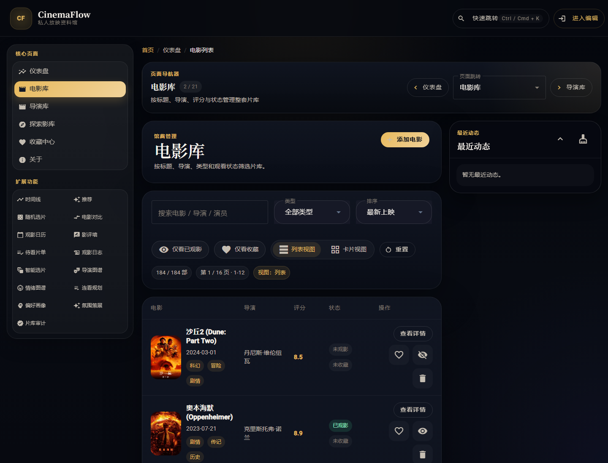
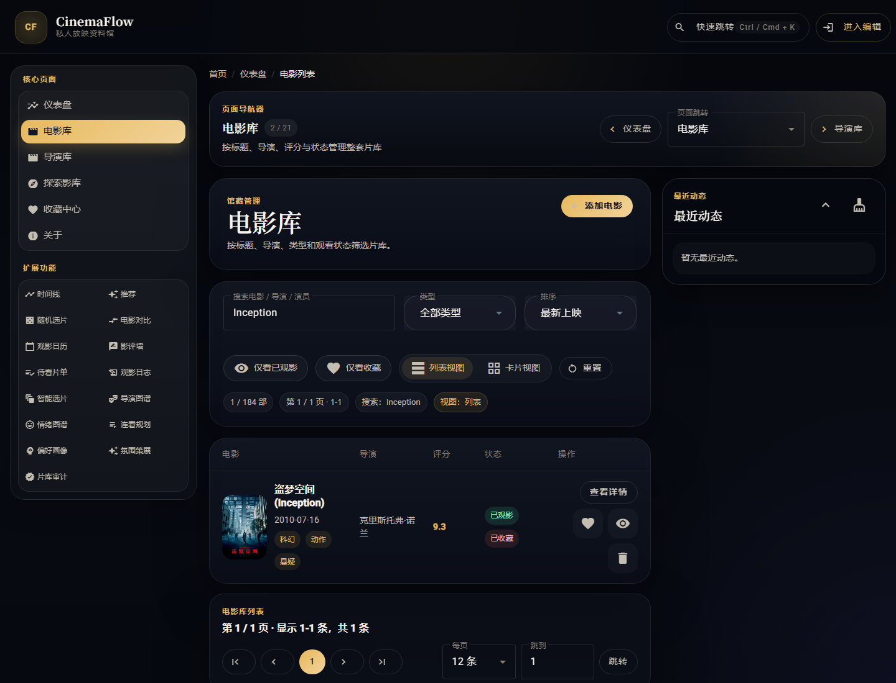
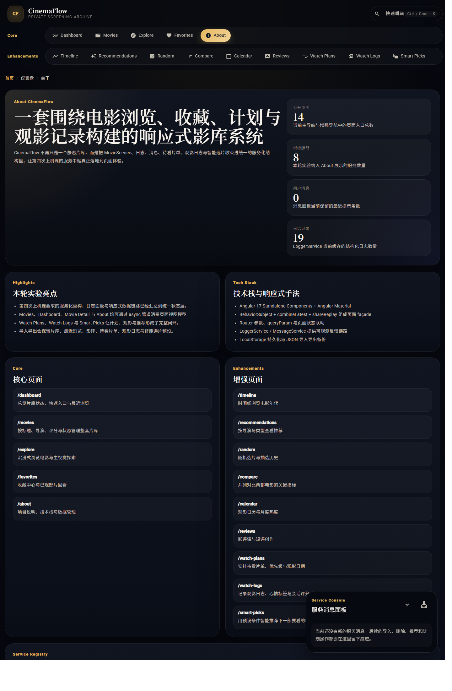
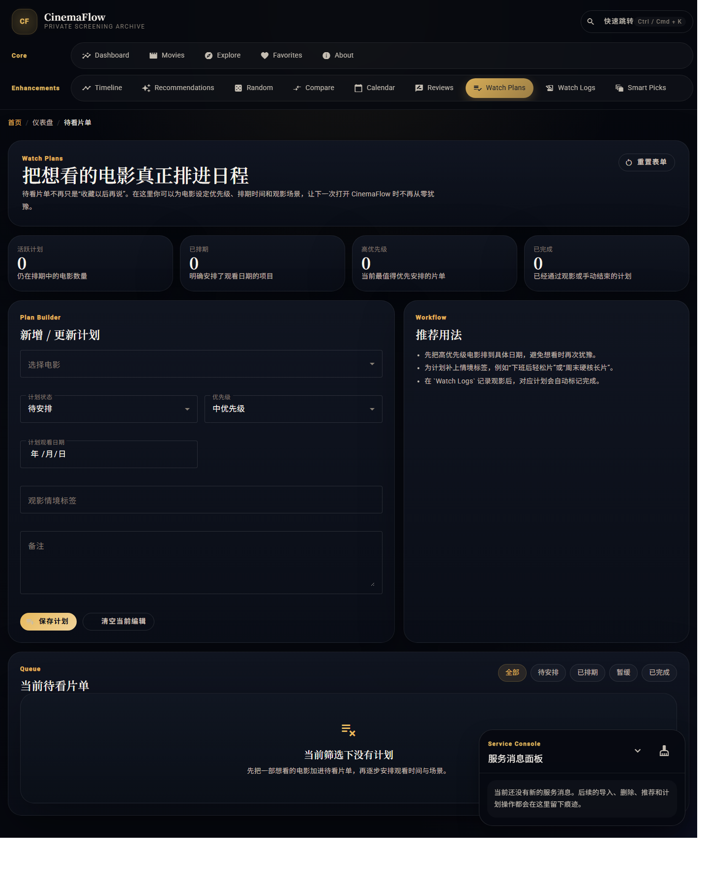
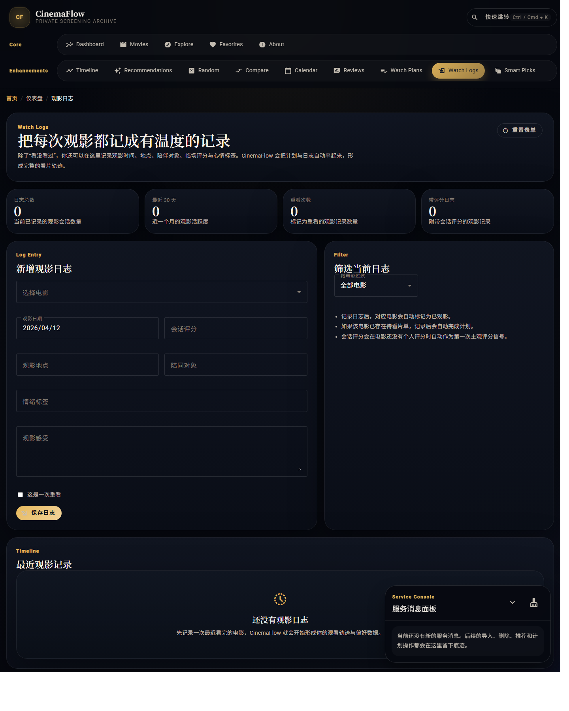
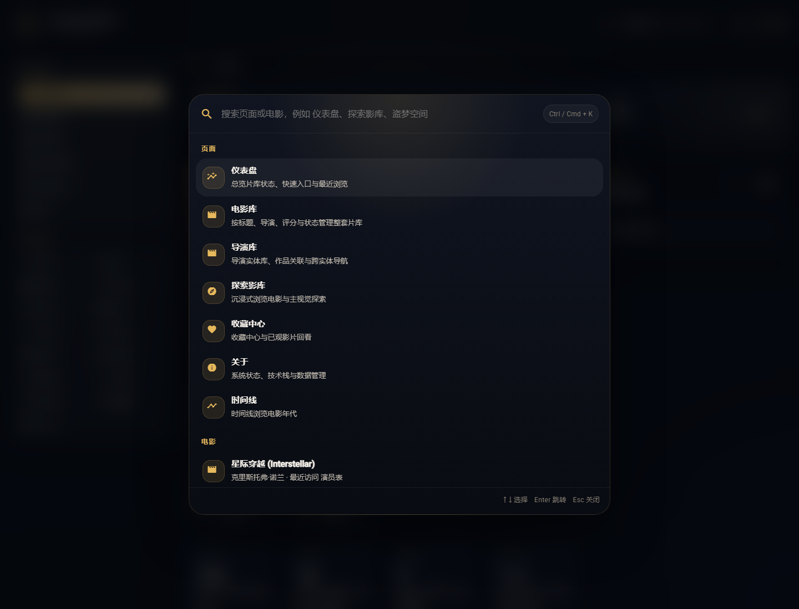

# CinemaFlow

CinemaFlow 是一个基于 Angular 17 Standalone Components 构建的电影库管理系统，采用深色玻璃态界面、金色高光和电影化卡片语言，覆盖电影浏览、详情查看、收藏管理、随机选片、时间线、日历、影评、数据备份与恢复等完整场景。


## 快速导航

- [当前版本概览](#当前版本概览)
- [主要功能](#主要功能)
- [路由地图](#路由地图)
- [数据与媒体策略](#数据与媒体策略)
- [目录结构](#目录结构)
- [启动方式](#启动方式)
- [提交要求对应说明](#提交要求对应说明)
- [已验证情况](#已验证情况)

## 交付清单

- 完整可运行的 Angular 项目代码
- 各主要路由页面与关键功能区域截图
- 路由配置关键代码位置说明
- 补充提交文档 [docs/SUBMISSION.md](docs/SUBMISSION.md)

## 当前版本概览

- Angular 17 Standalone + Angular Material + SCSS
- 标准片库页 `/movies` 与沉浸式探索页 `/explore` 并存
- 电影详情拆分为 `/movies/:id/info` 与 `/movies/:id/cast`
- 全局服务消息面板 + About 服务注册表，集中展示第四次上机课的服务化改造结果
- 全局快速跳转：`Ctrl / Cmd + K`
- 最近浏览：在仪表盘与详情页继续回到最近访问的电影
- 本地数据备份 / 恢复：导出与导入 JSON
- 待看片单、观影日志、智能选片三条创新页面链路已接入主导航
- 真实海报校验：新增与编辑电影时必须匹配真实海报资源

## 主要功能

| 模块 | 说明 |
| ------ | ------ |
| `Dashboard` | 首页总览，聚合统计、快捷入口、最近浏览、最近添加 |
| `Movies` | 标准片库页，支持搜索、类型筛选、排序、已看/收藏过滤、列表/卡片切换 |
| `Movie Detail` | 支持基本信息、演员表、上一部/下一部、删除、相关推荐 |
| `Add Movie` | 独立新增页面，复用真实海报校验与预览表单 |
| `Explore` | 保留原有沉浸式探索页，支持 Hero Banner、搜索、排序、收藏筛选 |
| `Favorites` | 收藏中心与已观看状态管理 |
| `Timeline` | 按年代组织电影时间线 |
| `Recommendations` | 按导演与类型查看推荐片单 |
| `Random` | 随机选片与抽选历史 |
| `Compare` | 两部电影并列对比评分、时长、语言、票房等信息 |
| `Calendar` | 按月份查看观影分布与当日片单 |
| `Reviews` | 影评墙、筛选、排序与手动录入 |
| `Watch Plans` | 待看片单、优先级与观影排期管理 |
| `Watch Logs` | 记录观影日志、会话评分、情绪标签与观影场景 |
| `Smart Picks` | 以预设条件做智能推荐，并一键写回待看片单 |
| `Command Palette` | 搜索页面与电影并快速跳转 |
| `Recent History` | 记录最近访问的电影详情 |
| `Data Management` | 导出和导入本地片库 JSON |

## 路由地图

| 路径 | 页面 |
| ------ | ------ |
| `/` | 重定向到 `/dashboard` |
| `/dashboard` | 仪表盘 |
| `/movies` | 标准电影列表页 |
| `/movies/:id/info` | 电影基本信息 |
| `/movies/:id/cast` | 电影演员表 |
| `/add` | 添加电影 |
| `/about` | 项目说明与数据管理 |
| `/explore` | 探索影库 |
| `/favorites` | 收藏中心 |
| `/timeline` | 时间线 |
| `/recommendations` | 推荐 |
| `/random` | 随机选片 |
| `/compare` | 对比 |
| `/calendar` | 日历 |
| `/reviews` | 影评墙 |
| `/watch-plans` | 待看片单 |
| `/watch-logs` | 观影日志 |
| `/smart-picks` | 智能选片 |
| `**` | 重定向到 `/dashboard` |

## 数据与媒体策略

### 片库数据

- 当前内置 `44` 部电影种子数据
- `MovieService` 使用 `BehaviorSubject` 管理全局状态
- 电影数据会写入本地存储，刷新后保留当前片库状态

### 海报与背景图

- 新增 / 编辑电影时会根据片名、导演、上映日期匹配真实海报
- 未通过真实海报校验的条目不会保存
- 背景图优先使用真实 `backdrop`
- 若背景图缺失或失效，会自动退回海报或生成兜底视觉

### 本地持久化

- 电影数据
- 最近浏览记录
- 影评墙数据
- 待看片单
- 观影日志
- 智能选片预设
- 导出包中的完整片库状态

## 目录结构

```text
src/app/
├── app.component.*                 # 全局壳层、导航、快捷跳转入口
├── app.routes.ts                   # 路由定义
├── components/
│   ├── breadcrumb/                 # 面包屑
│   ├── command-palette/            # 全局快速跳转
│   ├── confirm-dialog/             # 删除 / 导入确认弹窗
│   ├── data-management/            # 导出 / 导入 JSON
│   ├── message-panel/              # 全局服务消息面板
│   ├── movie-calendar/             # 观影日历
│   ├── movie-compare/              # 电影对比
│   ├── movie-detail-info/          # 详情基本信息子页
│   ├── movie-detail-cast/          # 详情演员表子页
│   ├── movie-favorites/            # 收藏中心
│   ├── movie-form/                 # 新增 / 编辑表单
│   ├── movie-list/                 # Explore 页面
│   ├── movie-random/               # 随机选片
│   ├── movie-recommendations/      # 推荐页
│   ├── movie-review-wall/          # 影评墙
│   ├── movie-stats/                # 统计组件
│   ├── movie-timeline/             # 时间线
│   ├── smart-picks/                # 智能选片
│   ├── watch-logs/                 # 观影日志
│   ├── watch-plans/                # 待看片单
│   └── recent-history/             # 最近浏览
├── config/
│   └── navigation.ts               # 导航与面包屑配置
├── data/
│   └── mock-movies.ts              # 种子电影数据
├── models/
│   ├── movie.ts                    # 电影类型
│   ├── review.ts                   # 影评类型
│   ├── viewing-preset.ts           # 智能选片预设模型
│   ├── watch-log.ts                # 观影日志模型
│   └── watch-plan.ts               # 待看片单模型
├── pages/
│   ├── about-page/                 # About 页面
│   ├── dashboard-page/             # Dashboard 页面
│   ├── movie-add-page/             # Add 页面
│   ├── movie-detail-page/          # 详情父页
│   └── movie-list-page/            # Movies 页面
├── services/
│   ├── data-port.service.ts        # 备份 / 恢复
│   ├── logger.service.ts           # 日志输出
│   ├── message.service.ts          # 服务消息总线
│   ├── movie-artwork.service.ts    # 海报匹配
│   ├── movie-state.service.ts      # 页面 view-model façade
│   ├── movie.service.ts            # 电影状态管理
│   ├── recent-history.service.ts   # 最近浏览
│   ├── review-store.service.ts     # 影评状态管理
│   ├── smart-picks.service.ts      # 智能选片服务
│   ├── watch-log.service.ts        # 观影日志服务
│   └── watch-plan.service.ts       # 待看片单服务
└── utils/
    ├── movie-media.ts              # 海报 / 背景图工具
    └── movie-query.ts              # Movies 页面查询参数工具
```

## 启动方式

```bash
npm install
npm start
```

默认访问：

```text
http://localhost:4200
```

## 常用命令

```bash
npm run build
npm run test -- --watch=false
```

## 提交要求对应说明

### 1. 完整可运行的项目代码

- 当前仓库包含完整 Angular 项目源码，可直接执行 `npm install`、`npm start`
- 路由、页面、服务、样式与本地状态管理已全部在仓库中
- 详细实现说明见 [docs/SUBMISSION.md](docs/SUBMISSION.md)

### 2. 截图展示各页面路由切换效果

实际截图已经直接生成并放在 `docs/screenshots/` 目录：

| 文件名 | 对应页面 / 区域 |
| ------ | ------ |
| `dashboard.png` | `/dashboard` |
| `movies.png` | `/movies` |
| `movies-search-inception.png` | `/movies?search=inception` |
| `movie-detail-info.png` | `/movies/3/info` |
| `movie-detail-cast.png` | `/movies/3/cast` |
| `add.png` | `/add` |
| `about.png` | `/about` |
| `watch-plans.png` | `/watch-plans` |
| `watch-logs.png` | `/watch-logs` |
| `smart-picks.png` | `/smart-picks` |
| `explore.png` | `/explore` |
| `command-palette.png` | 全局快速跳转面板 |
| `recent-history.png` | 最近浏览区域 |
| `data-management.png` | 数据备份与恢复区域 |

### 页面截图预览

以下图片均直接来自运行中的项目页面：

#### `/dashboard`


#### `/movies`



#### `/movies?search=inception`



#### `/movies/3/info`


#### `/movies/3/cast`


#### `/add`


#### `/about`



#### `/watch-plans`



#### `/watch-logs`



#### `/smart-picks`


#### `/explore`


#### 全局快速跳转面板



#### 最近浏览区域


#### 数据备份与恢复区域


### 3. 路由配置关键代码位置

核心代码位置如下：

- [src/app/app.routes.ts](src/app/app.routes.ts)
  - 定义应用主路由、懒加载页面、详情子路由、404 重定向
- [src/app/app.config.ts](src/app/app.config.ts)
  - 注册 `provideRouter(...)`，启用组件输入绑定与滚动恢复
- [src/app/app.component.html](src/app/app.component.html)
  - 定义全局 App Shell、顶部导航、导航高亮入口、`router-outlet` 与消息面板挂载位
- [src/app/services/movie-state.service.ts](src/app/services/movie-state.service.ts)
  - 组合 Movie / History / Review / WatchPlan / WatchLog / SmartPicks / Message / Logger，输出页面级 view-model
- [src/app/services/message.service.ts](src/app/services/message.service.ts)
  - 统一维护服务消息流，供右下角消息面板与 About 页面消费
- [src/app/components/breadcrumb/breadcrumb.component.ts](src/app/components/breadcrumb/breadcrumb.component.ts)
  - 根据当前路由动态生成面包屑
- [src/app/pages/movie-list-page/movie-list-page.component.ts](src/app/pages/movie-list-page/movie-list-page.component.ts)
  - 处理 `/movies` 的查询参数同步与列表 view-model 逻辑
- [src/app/pages/movie-detail-page/movie-detail-page.component.ts](src/app/pages/movie-detail-page/movie-detail-page.component.ts)
  - 处理 `/movies/:id` 父级详情上下文、上一部/下一部、删除、最近浏览与子页切换
- [src/app/app.routes.ts](src/app/app.routes.ts)
  - 注册 `/watch-plans`、`/watch-logs`、`/smart-picks` 三个新页面

## 已验证情况

- `npm run build`：已通过（存在 Angular bundle budget 警告，但不影响构建成功）
- `CHROME_BIN="C:\Program Files\Google\Chrome\Application\chrome.exe" npm run test -- --watch=false --browsers=ChromeHeadless`：已通过（1 个现有测试全部成功）
- `lint`：`package.json` 中没有 `lint` 脚本

## 补充文档

- 提交说明见 [docs/SUBMISSION.md](docs/SUBMISSION.md)
