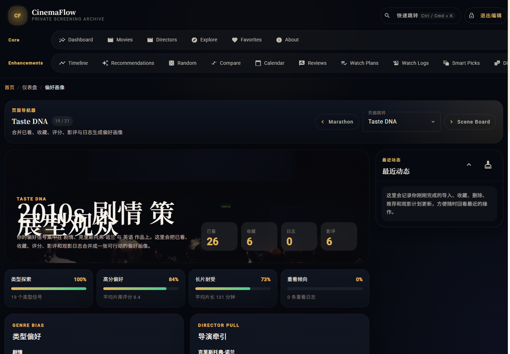
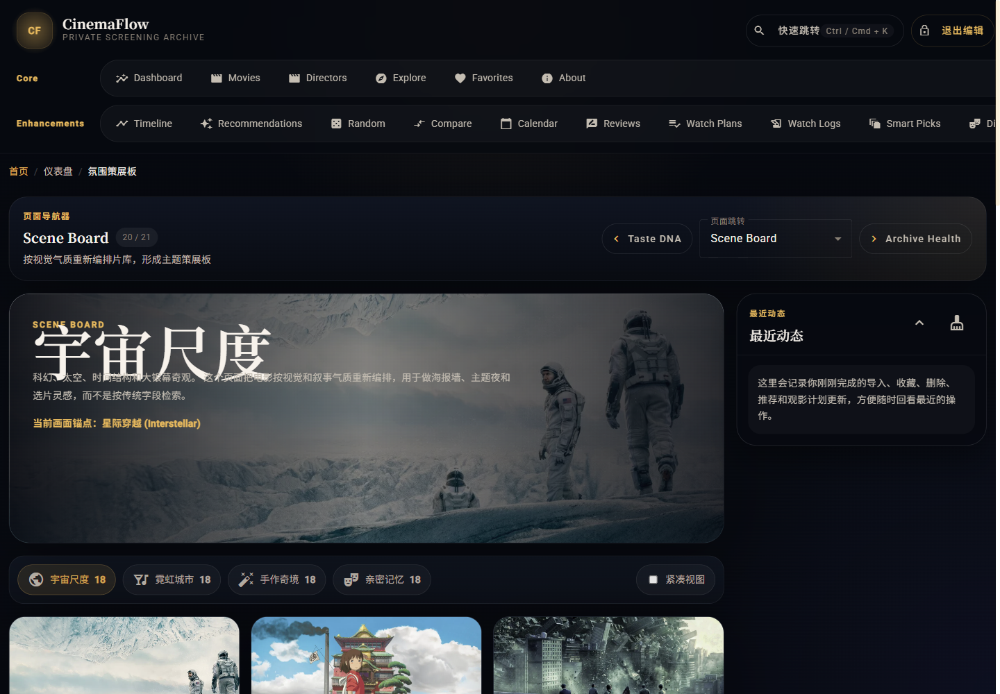
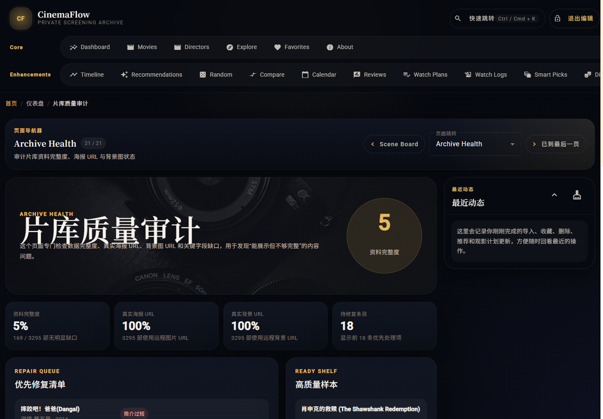

# CinemaFlow

CinemaFlow 是一个基于 Angular 17 Standalone Components 的电影库管理系统。当前版本完成了第五次、 第六次上机课 PDF 中的核心要求：新增 Director 实体与跨实体路由，加入分类路由与添加页路由守卫，并补齐 Flask RESTful API、Angular HttpClient、错误降级和防抖搜索。

在此基础上，本轮新增 3 个不重复的独立功能页：`Taste DNA`、`Scene Board`、`Archive Health`。它们分别负责偏好画像、视觉氛围策展和片库质量审计，不与已有 Random、Compare、Watch Plans、Mood Atlas、Director Atlas、Marathon 等页面重复。


## 版本亮点

- Angular 17 Standalone + Angular Material + SCSS 深色电影资料馆风格
- Flask 后端目录 `cinemaflow-api/`，提供电影与导演 RESTful API
- `provideHttpClient()` 接入 Angular HTTP 请求，API 不可用时自动降级到本地片库
- 新增 Director 实体：`/directors`、`/directors/:id`，支持电影详情跳导演、导演详情跳作品
- 新增分类路由：`/movies/genre/:genre`，电影详情与列表类型标签可直接跳转
- 新增认证守卫：`/add` 需要进入编辑模式后访问，演示账号逻辑为 `admin / admin`
- 命令面板改为 `debounceTime + distinctUntilChanged + switchMap` 防抖搜索
- 海报与背景不再大量落到文字 SVG 占位，缺失媒体会使用稳定远程图片 URL 兜底
- 新增 `Taste DNA`、`Scene Board`、`Archive Health` 三个创新功能页
- 全部主要页面已重新截图并更新到 `docs/screenshots/`

## 功能总览

| 模块 | 说明 |
| ------ | ------ |
| `Dashboard` | 聚合统计、最近浏览、最近添加与快速入口 |
| `Movies` | 标准片库视图，支持查询参数、筛选、排序、分页、布局切换 |
| `Genre Movies` | `/movies/genre/:genre` 分类路由，URL 与筛选状态同步 |
| `Movie Detail` | 详情父路由下拆分 `Info` / `Cast` 子页，支持相邻电影切换、导演与类型跳转 |
| `Add Movie` | 受路由守卫保护的新增页面，复用海报校验、预览和保存流程 |
| `Directors` | 独立导演实体列表，支持搜索导演、作品与风格关键词 |
| `Director Detail` | 导演档案、作品列表、上一位/下一位导演导航 |
| `Explore` | 沉浸式探索页，含 Hero Banner、筛选、排序、收藏过滤与分页 |
| `Favorites` | 收藏中心与已观看影片回看 |
| `Timeline` | 按年代查看片库分布 |
| `Recommendations` | 按导演与类型输出推荐片单 |
| `Random` | 随机选片与抽选历史 |
| `Compare` | 两部电影并列对比评分、时长、语言、票房等关键指标 |
| `Calendar` | 基于真实观影日志生成月视图、热度分布与当日记录面板 |
| `Reviews` | 影评墙、筛选、排序、录入与分页 |
| `Watch Plans` | 待看片单、优先级、状态与排期管理 |
| `Watch Logs` | 记录观影时间、情绪标签、陪同对象与会话评分 |
| `Smart Picks` | 依据预设条件做智能推荐，并一键回写待看片单 |
| `Director Atlas` | 按导演聚合作品数量、均分、收藏与已看进度 |
| `Mood Atlas` | 将观影日志中的情绪标签整理成偏好地图 |
| `Marathon Planner` | 按时长预算自动生成连看片单，并避免覆盖现有 active 计划 |
| `Taste DNA` | 合并已看、收藏、评分、影评与观影日志，生成个人偏好画像 |
| `Scene Board` | 按视觉气质重组片库，形成宇宙尺度、霓虹城市、手作奇境等策展板 |
| `Archive Health` | 审计片库资料完整度、真实海报 URL、背景图 URL 与待修复字段 |
| `Command Palette` | `Ctrl / Cmd + K` 搜索页面与电影并快速跳转 |
| `Data Management` | 导出和导入本地 JSON 备份 |

## 路由地图

| 路径 | 页面 |
| ------ | ------ |
| `/` | 重定向到 `/dashboard` |
| `/dashboard` | 仪表盘 |
| `/movies` | 标准电影列表页 |
| `/movies/genre/:genre` | 分类浏览 |
| `/movies/:id/info` | 电影基本信息 |
| `/movies/:id/cast` | 电影演员表 |
| `/add` | 添加电影，受 `authGuard` 保护 |
| `/directors` | 导演库 |
| `/directors/:id` | 导演详情 |
| `/about` | 项目说明与数据管理 |
| `/explore` | 探索影库 |
| `/favorites` | 收藏中心 |
| `/timeline` | 时间线 |
| `/recommendations` | 分类推荐 |
| `/random` | 随机选片 |
| `/compare` | 电影对比 |
| `/calendar` | 观影日历 |
| `/reviews` | 影评墙 |
| `/watch-plans` | 待看片单 |
| `/watch-logs` | 观影日志 |
| `/smart-picks` | 智能选片 |
| `/director-atlas` | 导演图谱 |
| `/mood-atlas` | 情绪图谱 |
| `/marathon` | 马拉松规划器 |
| `/taste-dna` | 偏好画像 |
| `/scene-board` | 氛围策展板 |
| `/archive-health` | 片库质量审计 |
| `**` | 重定向到 `/dashboard` |

## 新增三页说明

### Taste DNA

`/taste-dna` 会把已观看、收藏、个人评分、影评和观影日志合并成偏好画像。页面包含类型偏好、导演牵引、语言分布、年代偏好、长片耐受、重看倾向，以及“下一批值得补完”推荐。



### Scene Board

`/scene-board` 不按传统字段检索，而是按视觉和叙事气质重排片库。当前包括宇宙尺度、霓虹城市、手作奇境、亲密记忆等策展 lane，并提供画廊/紧凑视图切换。



### Archive Health

`/archive-health` 专门检查片库质量，统计资料完整度、真实海报 URL、真实背景 URL 和待修复条目。它用于发现“能展示但资料不完整”的问题。



## 第五次上机课完成点

- 新增 `Director` 数据模型：[src/app/models/director.ts](src/app/models/director.ts)
- 新增 `DirectorService`：[src/app/services/director.service.ts](src/app/services/director.service.ts)
- 新增导演列表页与详情页：[director-list-page](src/app/pages/director-list-page)、[director-detail-page](src/app/pages/director-detail-page)
- 新增 `/directors`、`/directors/:id` 路由
- 电影模型补充 `directorId`、`genre`、`releaseYear`、`status` 兼容字段
- 电影详情页导演名可跳转 `/directors/:id`
- 类型标签可跳转 `/movies/genre/:genre`
- 新增 `AuthService` 与函数式 `authGuard`，保护 `/add`

## 第六次上机课完成点

- 新增 Flask 后端目录：[cinemaflow-api](cinemaflow-api)
- `app.py` 配置 Flask、Blueprint、CORS 和 `/api/health`
- `routes/movies.py` 提供 `GET / POST / PUT / DELETE /api/movies`
- `routes/directors.py` 提供 `GET / POST / DELETE /api/directors` 与 `/api/directors/:id/movies`
- `models.py` 提供内置数据、JSON 落盘、ID 生成和快照读取
- Angular `app.config.ts` 加入 `provideHttpClient()`
- `MovieService` 具备 HTTP 同步、错误捕获、本地降级与乐观状态更新
- `DirectorService` 具备 HTTP 查询、导演作品查询与本地聚合降级
- 命令面板电影搜索使用防抖流，避免每次按键立即请求

## 数据与媒体策略

### 片库数据

- 内置 `44` 部电影种子数据作为离线基础片库
- `MovieService` 使用 `BehaviorSubject` 维护主状态
- 若 Flask API 可用，会先合并 API 数据
- 若远程扩展数据可用，会继续合并 Vega / Erik 数据源并去重
- 去重基于规范化标题与上映年份，避免中文名/英文名重复

### 海报与背景图

- TMDB、Wikimedia 等真实图片 URL 会被规范化为合适尺寸
- 已知不稳定的 `ia.media-imdb.com` 图片会被过滤，避免页面出现 404 破图
- 当远程数据缺失海报或背景时，系统使用 `https://picsum.photos/seed/...` 生成稳定远程 URL
- 只有远程图片加载失败时，前端才会使用 SVG 作为最后兜底
- 导出 JSON 时不再大量保存文字 SVG 占位资源

### 本地持久化与导出

- 电影主库
- 最近浏览记录
- 影评墙数据
- 待看片单
- 观影日志
- 智能选片预设
- 导出包中的完整片库状态

## 后端启动

```bash
cd cinemaflow-api
python -m pip install -r requirements.txt
python app.py
```

默认后端地址：`http://localhost:5000`

可验证：

```bash
curl http://localhost:5000/api/health
curl http://localhost:5000/api/movies
curl http://localhost:5000/api/directors
curl http://localhost:5000/api/directors/1/movies
```

## 前端启动

```bash
npm install
npm start
```

默认前端地址：`http://localhost:4200`

如果访问 `/add` 被拦截，点击顶部“进入编辑”按钮即可进入演示编辑模式。

## 截图清单

完整截图位于 `docs/screenshots/`：

| 文件名 | 对应页面 / 区域 |
| ------ | ------ |
| `dashboard.png` | `/dashboard` |
| `movies.png` | `/movies` |
| `movies-search-inception.png` | `/movies?search=inception` |
| `movies-genre-sci-fi.png` | `/movies/genre/科幻` |
| `movie-detail-info.png` | `/movies/3/info` |
| `movie-detail-cast.png` | `/movies/3/cast` |
| `add.png` | `/add` |
| `about.png` | `/about` |
| `directors.png` | `/directors` |
| `director-detail.png` | `/directors/1` |
| `explore.png` | `/explore` |
| `favorites.png` | `/favorites` |
| `timeline.png` | `/timeline` |
| `recommendations.png` | `/recommendations` |
| `random.png` | `/random` |
| `compare.png` | `/compare` |
| `calendar.png` | `/calendar` |
| `reviews.png` | `/reviews` |
| `watch-plans.png` | `/watch-plans` |
| `watch-logs.png` | `/watch-logs` |
| `smart-picks.png` | `/smart-picks` |
| `director-atlas.png` | `/director-atlas` |
| `mood-atlas.png` | `/mood-atlas` |
| `marathon.png` | `/marathon` |
| `taste-dna.png` | `/taste-dna` |
| `scene-board.png` | `/scene-board` |
| `archive-health.png` | `/archive-health` |
| `command-palette.png` | 全局命令面板 |
| `recent-history.png` | 最近浏览区域 |
| `data-management.png` | 数据管理区域 |

## 目录结构

```text
cinemaflow-api/
├── app.py                         # Flask 应用入口、CORS、健康检查
├── models.py                      # 电影/导演数据、JSON 落盘与 ID 生成
├── requirements.txt               # Flask 依赖
└── routes/
    ├── directors.py               # 导演 RESTful API
    └── movies.py                  # 电影 RESTful API

src/app/
├── app.component.*                # 全局壳层、导航、命令入口与消息侧栏
├── app.config.ts                  # Router、HttpClient、Animations
├── app.routes.ts                  # 顶级路由、详情子路由、守卫与 404
├── components/
│   ├── archive-health/            # 新增：片库质量审计
│   ├── scene-board/               # 新增：视觉氛围策展板
│   ├── taste-dna/                 # 新增：个人偏好画像
│   ├── command-palette/           # 防抖搜索与快速跳转
│   ├── data-management/           # 导出 / 导入 JSON
│   ├── director-atlas/            # 导演图谱
│   ├── mood-atlas/                # 情绪图谱
│   ├── marathon-planner/          # 马拉松规划器
│   └── ...
├── guards/
│   └── auth.guard.ts              # 函数式 CanActivate 守卫
├── models/
│   ├── director.ts                # 导演实体
│   └── movie.ts                   # 电影实体与后端兼容字段
├── pages/
│   ├── director-list-page/        # 导演列表页
│   ├── director-detail-page/      # 导演详情页
│   └── ...
├── services/
│   ├── auth.service.ts            # 演示认证状态
│   ├── director.service.ts        # 导演 HTTP / 本地降级服务
│   ├── movie.service.ts           # 电影状态、HTTP 同步、扩库与媒体修复
│   └── ...
└── utils/
    ├── director-identity.ts       # 导演 ID 映射
    ├── movie-media.ts             # 海报 / 背景 URL 规范化与兜底
    ├── movie-query.ts             # Movies 查询参数
    └── pagination.ts              # 通用分页
```

## 验证结果

本轮实际执行：

```bash
npm run build
npm test -- --watch=false --browsers=ChromeHeadless
```

结果：

- `npm run build`：通过
- `npm test -- --watch=false --browsers=ChromeHeadless`：通过，`12 / 12` 测试成功
- 构建仍有既有 Angular budget warning：initial bundle 超过 1MB、`movie-list.component.scss` 超过 10KB，不影响产物生成
- Flask API 已启动验证：`/api/health` 返回 `ok`
- 截图已通过 Playwright 自动化重新生成到 `docs/screenshots/`

## 关键实现位置

- [src/app/app.routes.ts](src/app/app.routes.ts)
- [src/app/config/navigation.ts](src/app/config/navigation.ts)
- [src/app/services/movie.service.ts](src/app/services/movie.service.ts)
- [src/app/services/director.service.ts](src/app/services/director.service.ts)
- [src/app/services/auth.service.ts](src/app/services/auth.service.ts)
- [src/app/guards/auth.guard.ts](src/app/guards/auth.guard.ts)
- [src/app/components/taste-dna/taste-dna.component.ts](src/app/components/taste-dna/taste-dna.component.ts)
- [src/app/components/scene-board/scene-board.component.ts](src/app/components/scene-board/scene-board.component.ts)
- [src/app/components/archive-health/archive-health.component.ts](src/app/components/archive-health/archive-health.component.ts)
- [cinemaflow-api/app.py](cinemaflow-api/app.py)
- [cinemaflow-api/routes/movies.py](cinemaflow-api/routes/movies.py)
- [cinemaflow-api/routes/directors.py](cinemaflow-api/routes/directors.py)
