# CinemaFlow 电影库管理系统汇报

> 系统类型：私人电影资料馆与观影管理系统  
> 技术栈：Angular 17 Standalone Components + Flask REST API + 关系型数据库设计  
> 文档定位：说明系统业务、架构、数据库、API、前端设计、核心代码与全部页面功能。

---

## 目录

1. 系统简介
2. 系统功能总览
3. 架构设计说明
4. 数据库设计
5. API 设计
6. 前端设计
7. 核心代码解析
8. 页面截图与功能说明
9. 系统问题与总结

---

## 1. 系统简介

### 1.1 业务背景

CinemaFlow 面向个人影迷、电影资料整理者和课程项目展示场景。普通表格或笔记软件可以记录片名和评分，但当电影数量增多后，用户会自然遇到几个问题：电影资料分散、导演与作品关系不清晰、观影计划和观影日志没有闭环、收藏与偏好难以统计、媒体图片 URL 质量无法统一检查。

CinemaFlow 将电影资料、导演档案、观影计划、观影日志、影评、推荐、偏好画像和片库审计整合到一个系统里。系统不只是展示电影卡片，而是围绕“电影资料长期维护”和“观影行为沉淀”建立完整业务链路。

### 1.2 主要用户

| 用户角色 | 关注点 | 典型操作 |
| --- | --- | --- |
| 普通影迷 | 快速找到想看的电影，记录已看、收藏和评分 | 浏览电影库、收藏电影、写观影日志、查看推荐 |
| 资料维护者 | 保证电影资料、导演资料、海报和背景图完整 | 添加电影、维护 URL、查看片库审计 |
| 电影内容整理者 | 通过导演、类型、年代、情绪组织片单 | 使用导演图谱、情绪图谱、氛围策展、连看规划 |
| 系统评审人员 | 了解系统功能完整度、架构边界和数据关系 | 查看架构图、ER 图、API 表、页面截图 |
| 开发维护者 | 扩展接口、数据库和前端页面 | 阅读服务层、状态流、路由和数据库设计 |

### 1.3 系统解决的问题

| 问题 | CinemaFlow 的解决方式 |
| --- | --- |
| 电影数量增加后难以查找 | 提供电影库搜索、类型路由、排序、分页和命令面板 |
| 电影与导演资料割裂 | 建立电影、导演、代表作、导演详情和导演图谱 |
| “想看”和“已看”没有闭环 | 提供待看片单、观影日志、观影日历和偏好画像 |
| 收藏、评分、影评难以统计 | 提供收藏中心、影评墙、用户评分和推荐算法 |
| 媒体 URL 质量参差不齐 | 提供真实 URL 规范化、加载兜底和片库审计 |
| 页面多、状态复杂 | 使用 Angular Router、服务层封装和 RxJS 状态流统一管理 |
| 后续扩展数据库困难 | 按关系型模型设计电影、人员、日志、计划、审计等实体 |

---

## 2. 系统功能总览

### 2.1 核心业务链路

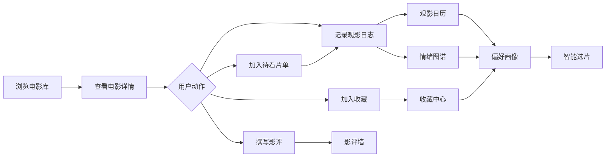
```mermaid
flowchart LR
  A[浏览电影库] --> B[查看电影详情]
  B --> C{用户动作}
  C --> D[加入收藏]
  C --> E[加入待看片单]
  C --> F[记录观影日志]
  C --> G[撰写影评]
  E --> F
  F --> H[观影日历]
  F --> I[情绪图谱]
  D --> J[收藏中心]
  G --> K[影评墙]
  H --> L[偏好画像]
  I --> L
  J --> L
  L --> M[智能选片]
```

这条链路体现系统的核心价值：电影资料不是静态列表，而是会随着用户行为不断沉淀。用户从“发现一部电影”开始，可以进入详情、收藏、计划观看、完成观看、写下日志和影评，最后形成偏好画像，并反过来影响推荐和智能选片。

### 2.2 功能模块划分

| 模块 | 页面/组件 | 业务价值 |
| --- | --- | --- |
| 片库总览 | 仪表盘、最近浏览、最近添加 | 快速了解片库规模、评分、收藏和浏览动态 |
| 电影管理 | 电影库、分类浏览、电影详情、演员表、添加电影 | 完成电影资料的浏览、检索、录入和详情展示 |
| 导演资料 | 导演库、导演详情、导演图谱 | 以导演为维度组织作品和作者风格 |
| 观影行为 | 待看片单、观影日志、观影日历 | 管理从计划到观看完成的行为记录 |
| 内容表达 | 影评墙、收藏中心 | 保存主观评价、评论内容和高价值收藏 |
| 推荐分析 | 推荐页、随机选片、智能选片、偏好画像 | 帮助用户做下一部电影选择 |
| 高级策展 | 时间线、电影对比、情绪图谱、连看规划、氛围策展 | 从年代、情绪、主题和时长角度重组片库 |
| 系统维护 | 片库审计、关于页、数据管理、命令面板 | 提供资料质量检查、运行状态、导入导出和快速跳转 |

### 2.3 数据对象

系统围绕以下业务对象展开：

- 电影：片名、导演、类型、评分、时长、语言、简介、海报、背景图、预告片。
- 导演：姓名、国籍、出生年份、头像、活跃年代、风格、获奖、代表作。
- 用户电影状态：是否已看、是否收藏、个人评分、个人笔记、观看次数。
- 影评：作者、评分、标题、正文、点赞数。
- 待看片单：优先级、计划日期、观看场景、状态、备注。
- 观影日志：观看日期、地点、陪伴对象、会话评分、情绪标签、笔记。
- 媒体资源：电影海报、背景图、导演头像、提供方、检查时间。
- 最近浏览：用户进入详情页后的访问轨迹。
- 智能选片预设：时长、评分、类型、语言、是否包含已看、是否偏好收藏。

---

## 3. 架构设计说明

### 3.1 Flask 单体 B/S 架构的特点

传统 Flask 单体 B/S 架构通常由 Flask 同时承担页面渲染、接口、静态资源、表单提交、业务逻辑和数据访问。

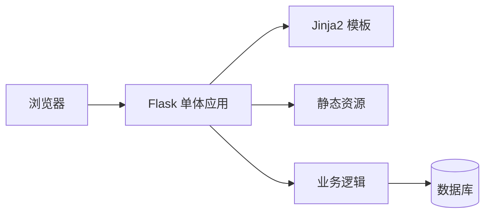
```mermaid
flowchart LR
  Browser[浏览器] --> Flask[Flask 单体应用]
  Flask --> Template[Jinja2 模板]
  Flask --> Static[静态资源]
  Flask --> Business[业务逻辑]
  Business --> DB[(数据库)]
```

这种架构适合页面数量少、交互简单的系统。对于 CinemaFlow 这种页面数量多、局部状态多、搜索筛选频繁、需要命令面板和多种分析页面的系统，单体模板会让前端交互和后端数据逻辑紧密耦合。页面变化会影响后端模板，接口也不容易复用给其他客户端。

### 3.2 前后端分离架构

CinemaFlow 采用 Angular SPA + Flask REST API 的前后端分离结构。前端负责路由、组件、状态流和交互体验；后端负责 REST API、数据校验、跨域策略和持久化；数据库负责保存电影资料和用户行为。

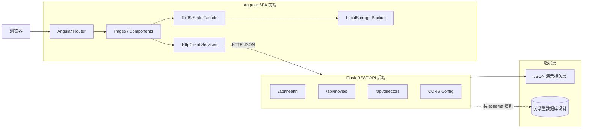
```mermaid
flowchart LR
  subgraph Frontend[Angular SPA 前端]
    Router[Angular Router]
    Pages[Pages / Components]
    Services[HttpClient Services]
    State[RxJS State Facade]
    Storage[LocalStorage Backup]
  end

  subgraph Backend[Flask REST API 后端]
    Health["/api/health"]
    MovieApi["/api/movies"]
    DirectorApi["/api/directors"]
    Cors[CORS Config]
  end

  subgraph Data[数据层]
    JsonStore[JSON 演示持久层]
    SQL[(关系型数据库设计)]
  end

  Browser[浏览器] --> Router
  Router --> Pages
  Pages --> Services
  Pages --> State
  Services -->|HTTP JSON| Backend
  Backend --> JsonStore
  Backend -.按 schema 演进.-> SQL
  State --> Storage
```

### 3.3 架构职责对比

| 维度 | Flask 单体 B/S | CinemaFlow 前后端分离 |
| --- | --- | --- |
| 页面渲染 | Flask 模板生成 HTML | Angular 组件在浏览器渲染 |
| 页面路由 | 后端 route 控制页面跳转 | Angular Router 控制 SPA 页面和子路由 |
| 数据交换 | 模板上下文或表单提交 | REST JSON |
| 状态管理 | 依赖页面刷新和服务端上下文 | RxJS、BehaviorSubject、combineLatest、LocalStorage |
| 前端部署 | 依赖后端应用一起发布 | 前端构建产物可独立托管 |
| 后端职责 | 页面、静态资源、接口混合 | API、校验、持久化、CORS |
| 数据库演进 | 常和模板逻辑缠在一起 | API 合约稳定，数据库可在后端内部演进 |
| 扩展客户端 | 复用困难 | REST API 可提供给移动端、小程序或其他客户端 |

### 3.4 系统分层

系统按职责拆成七个层次，各层之间通过清晰的数据对象和服务接口协作，避免页面组件直接处理持久化细节。

- 表现层：对应 `pages/` 和 `components/`，负责页面布局、用户交互、表格、卡片、图谱和表单展示。
- 路由层：对应 `app.routes.ts` 和 `auth.guard.ts`，负责页面路由、详情页子路由和添加页权限守卫。
- 状态层：对应 `MovieStateService`，聚合电影、最近浏览、影评、日志、计划等数据，形成页面 ViewModel。
- 业务服务层：对应 `MovieService`、`DirectorService`、`WatchLogService` 等服务，负责实体管理、查询封装、API 同步和本地降级。
- 配置层：对应 `api.config.ts` 和 `runtime-config.js`，负责解耦构建产物和 API 根路径。
- 后端 API 层：对应 Flask Blueprints，提供电影和导演 REST API，并负责请求校验、CORS 和持久化入口。
- 数据层：对应 JSON 演示持久层和关系型 schema，保存电影、导演、用户行为、媒体资源和审计数据。

---

## 4. 数据库设计

### 4.1 设计原则

CinemaFlow 的数据库采用关系型设计，核心原则如下：

- 电影和导演属于主数据，字段稳定、复用频率高。
- 类型、演员、媒体资源拆成独立表，避免在电影表中堆叠多值字段。
- 收藏、已看、个人评分、笔记属于用户和电影之间的状态，因此放入 `user_movie_states`。
- 影评、待看片单、观影日志属于用户围绕电影产生的业务事件，应独立建表。
- 情绪标签是观影日志的多值属性，使用 `watch_log_moods` 拆表。
- 最近浏览和审计日志属于行为轨迹，支持统计和问题追溯。
- 媒体资源表用于记录海报、背景图、头像等 URL，便于审计和替换。

### 4.2 完整 ER 图

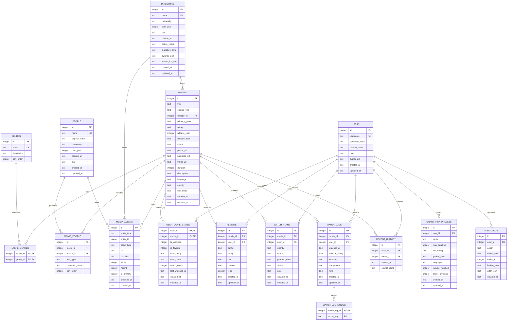
```mermaid
erDiagram
  USERS {
    integer id PK
    text username UK
    text password_hash
    text display_name
    text role
    text avatar_url
    text created_at
    text updated_at
  }

  DIRECTORS {
    integer id PK
    text name UK
    text nationality
    integer birth_year
    text bio
    text portrait_url
    text active_years
    text signature_style
    text awards_json
    text known_for_json
    text created_at
    text updated_at
  }

  MOVIES {
    integer id PK
    text title
    text original_title
    integer director_id FK
    text primary_genre
    real rating
    integer release_year
    text release_date
    text status
    text poster_url
    text backdrop_url
    text trailer_url
    integer duration
    text description
    text language
    text country
    real box_office
    text created_at
    text updated_at
  }

  GENRES {
    integer id PK
    text name UK
    text description
    integer sort_order
  }

  MOVIE_GENRES {
    integer movie_id PK,FK
    integer genre_id PK,FK
  }

  PEOPLE {
    integer id PK
    text name UK
    text original_name
    text nationality
    integer birth_year
    text portrait_url
    text bio
    text created_at
    text updated_at
  }

  MOVIE_PEOPLE {
    integer id PK
    integer movie_id FK
    integer person_id FK
    text role_type
    text character_name
    integer sort_order
  }

  MEDIA_ASSETS {
    integer id PK
    text entity_type
    integer entity_id
    text asset_type
    text url
    text provider
    integer width
    integer height
    integer is_primary
    text checked_at
    text created_at
  }

  USER_MOVIE_STATES {
    integer user_id PK,FK
    integer movie_id PK,FK
    integer is_watched
    integer is_favorite
    real user_rating
    text user_notes
    integer watch_count
    text last_watched_at
    text created_at
    text updated_at
  }

  REVIEWS {
    integer id PK
    integer movie_id FK
    integer user_id FK
    text author
    real rating
    text title
    text content
    integer likes
    text created_at
    text updated_at
  }

  WATCH_PLANS {
    integer id PK
    integer movie_id FK
    integer user_id FK
    text priority
    text status
    text planned_date
    text scene
    text note
    text created_at
    text updated_at
  }

  WATCH_LOGS {
    integer id PK
    integer movie_id FK
    integer user_id FK
    text watched_at
    real session_rating
    text location
    text companion
    text note
    text created_at
    text updated_at
  }

  WATCH_LOG_MOODS {
    integer watch_log_id PK,FK
    text mood_tag PK
  }

  RECENT_HISTORY {
    integer id PK
    integer user_id FK
    integer movie_id FK
    text viewed_at
    text source_route
  }

  SMART_PICK_PRESETS {
    integer id PK
    integer user_id FK
    text name
    integer max_duration
    real min_rating
    text genres_json
    text language
    integer include_watched
    integer prefer_favorites
    text created_at
    text updated_at
  }

  AUDIT_LOGS {
    integer id PK
    integer user_id FK
    text action
    text entity_type
    integer entity_id
    text before_json
    text after_json
    text created_at
  }

  DIRECTORS ||--o{ MOVIES : directs
  MOVIES ||--o{ MOVIE_GENRES : has
  GENRES ||--o{ MOVIE_GENRES : classifies
  MOVIES ||--o{ MOVIE_PEOPLE : includes
  PEOPLE ||--o{ MOVIE_PEOPLE : performs
  MOVIES ||--o{ MEDIA_ASSETS : owns
  DIRECTORS ||--o{ MEDIA_ASSETS : owns
  PEOPLE ||--o{ MEDIA_ASSETS : owns
  USERS ||--o{ USER_MOVIE_STATES : marks
  MOVIES ||--o{ USER_MOVIE_STATES : marked_by
  USERS ||--o{ REVIEWS : writes
  MOVIES ||--o{ REVIEWS : receives
  USERS ||--o{ WATCH_PLANS : plans
  MOVIES ||--o{ WATCH_PLANS : planned
  USERS ||--o{ WATCH_LOGS : records
  MOVIES ||--o{ WATCH_LOGS : watched
  WATCH_LOGS ||--o{ WATCH_LOG_MOODS : tagged
  USERS ||--o{ RECENT_HISTORY : browses
  MOVIES ||--o{ RECENT_HISTORY : viewed
  USERS ||--o{ SMART_PICK_PRESETS : saves
  USERS ||--o{ AUDIT_LOGS : operates
```

完整 ER 图展示所有实体之间的全局关系。由于系统实体较多，为了让评审时更容易看清业务边界，下面再按“核心资料”“用户行为”“媒体与审计”拆成三张局部 ER 图。

### 4.3 核心资料 ER 图

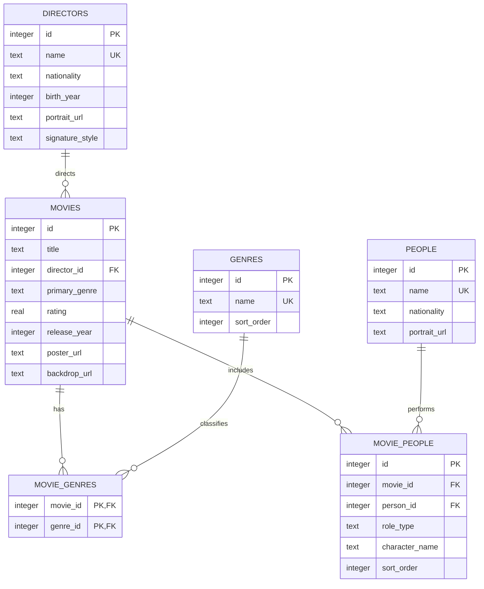
```mermaid
erDiagram
  DIRECTORS {
    integer id PK
    text name UK
    text nationality
    integer birth_year
    text portrait_url
    text signature_style
  }

  MOVIES {
    integer id PK
    text title
    integer director_id FK
    text primary_genre
    real rating
    integer release_year
    text poster_url
    text backdrop_url
  }

  GENRES {
    integer id PK
    text name UK
    integer sort_order
  }

  MOVIE_GENRES {
    integer movie_id PK,FK
    integer genre_id PK,FK
  }

  PEOPLE {
    integer id PK
    text name UK
    text nationality
    text portrait_url
  }

  MOVIE_PEOPLE {
    integer id PK
    integer movie_id FK
    integer person_id FK
    text role_type
    text character_name
    integer sort_order
  }

  DIRECTORS ||--o{ MOVIES : directs
  MOVIES ||--o{ MOVIE_GENRES : has
  GENRES ||--o{ MOVIE_GENRES : classifies
  MOVIES ||--o{ MOVIE_PEOPLE : includes
  PEOPLE ||--o{ MOVIE_PEOPLE : performs
```

核心资料区解决“电影是什么、由谁导演、属于哪些类型、有哪些演员”的问题。`movies` 是核心表，`directors` 是电影的一对多上游实体，`genres` 与 `people` 通过关系表和电影连接。这样设计可以避免电影表里出现长字符串数组，方便后续按导演、类型、演员做查询和统计。

### 4.4 用户行为 ER 图

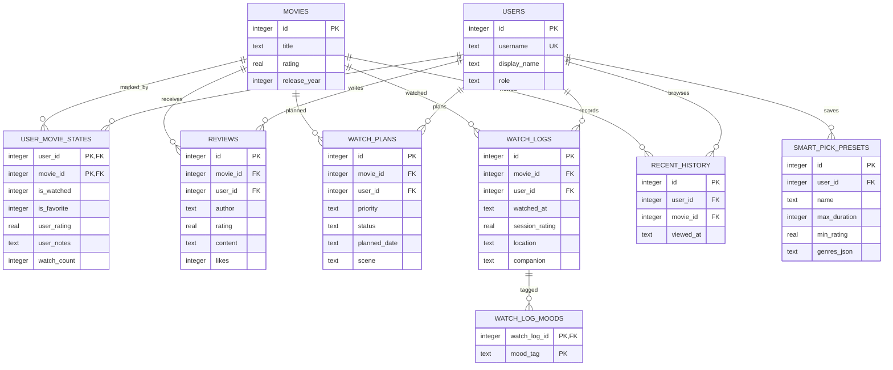
```mermaid
erDiagram
  USERS {
    integer id PK
    text username UK
    text display_name
    text role
  }

  MOVIES {
    integer id PK
    text title
    real rating
    integer release_year
  }

  USER_MOVIE_STATES {
    integer user_id PK,FK
    integer movie_id PK,FK
    integer is_watched
    integer is_favorite
    real user_rating
    text user_notes
    integer watch_count
  }

  REVIEWS {
    integer id PK
    integer movie_id FK
    integer user_id FK
    text author
    real rating
    text content
    integer likes
  }

  WATCH_PLANS {
    integer id PK
    integer movie_id FK
    integer user_id FK
    text priority
    text status
    text planned_date
    text scene
  }

  WATCH_LOGS {
    integer id PK
    integer movie_id FK
    integer user_id FK
    text watched_at
    real session_rating
    text location
    text companion
  }

  WATCH_LOG_MOODS {
    integer watch_log_id PK,FK
    text mood_tag PK
  }

  RECENT_HISTORY {
    integer id PK
    integer user_id FK
    integer movie_id FK
    text viewed_at
  }

  SMART_PICK_PRESETS {
    integer id PK
    integer user_id FK
    text name
    integer max_duration
    real min_rating
    text genres_json
  }

  USERS ||--o{ USER_MOVIE_STATES : marks
  MOVIES ||--o{ USER_MOVIE_STATES : marked_by
  USERS ||--o{ REVIEWS : writes
  MOVIES ||--o{ REVIEWS : receives
  USERS ||--o{ WATCH_PLANS : plans
  MOVIES ||--o{ WATCH_PLANS : planned
  USERS ||--o{ WATCH_LOGS : records
  MOVIES ||--o{ WATCH_LOGS : watched
  WATCH_LOGS ||--o{ WATCH_LOG_MOODS : tagged
  USERS ||--o{ RECENT_HISTORY : browses
  MOVIES ||--o{ RECENT_HISTORY : viewed
  USERS ||--o{ SMART_PICK_PRESETS : saves
```

用户行为区解决“用户如何使用电影资料”的问题。收藏、已看、个人评分和笔记不直接放在 `movies` 表里，而是放在 `user_movie_states`，这样同一部电影可以被不同用户以不同方式标记。影评、待看片单和观影日志是三类独立事件，分别对应评论、计划和实际观看。

### 4.5 媒体与审计 ER 图

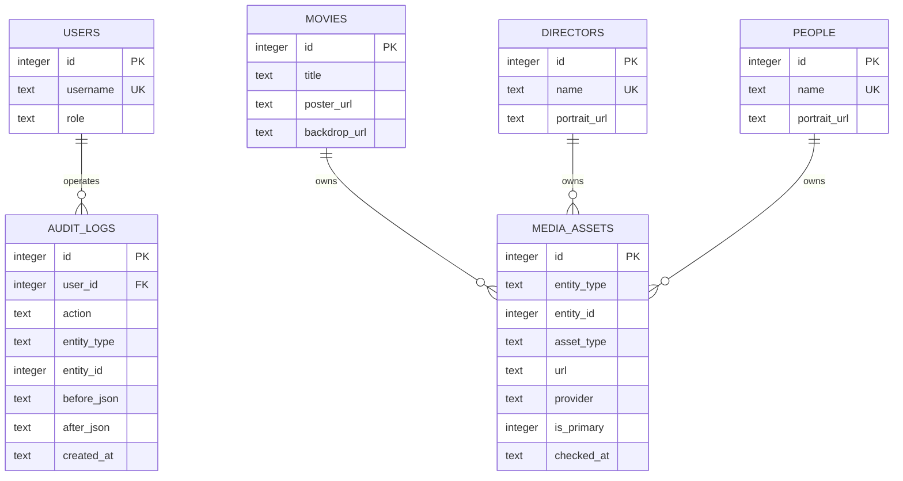
```mermaid
erDiagram
  USERS {
    integer id PK
    text username UK
    text role
  }

  MOVIES {
    integer id PK
    text title
    text poster_url
    text backdrop_url
  }

  DIRECTORS {
    integer id PK
    text name UK
    text portrait_url
  }

  PEOPLE {
    integer id PK
    text name UK
    text portrait_url
  }

  MEDIA_ASSETS {
    integer id PK
    text entity_type
    integer entity_id
    text asset_type
    text url
    text provider
    integer is_primary
    text checked_at
  }

  AUDIT_LOGS {
    integer id PK
    integer user_id FK
    text action
    text entity_type
    integer entity_id
    text before_json
    text after_json
    text created_at
  }

  MOVIES ||--o{ MEDIA_ASSETS : owns
  DIRECTORS ||--o{ MEDIA_ASSETS : owns
  PEOPLE ||--o{ MEDIA_ASSETS : owns
  USERS ||--o{ AUDIT_LOGS : operates
```

媒体与审计区解决“资料是否可靠、操作是否可追溯”的问题。`media_assets` 通过 `entity_type + entity_id` 关联电影、导演、人物等多类实体，适合统一管理海报、背景图、头像和检查时间。`audit_logs` 记录关键写操作，保存修改前后数据，方便后续排查误删、误改和资料质量问题。

### 4.6 主要表结构说明

| 表 | 业务含义 | 关键字段 | 关系说明 |
| --- | --- | --- | --- |
| `users` | 系统用户 | `username`, `password_hash`, `role` | 与评分、收藏、影评、日志、计划关联 |
| `directors` | 导演主档 | `name`, `portrait_url`, `signature_style` | 一位导演可执导多部电影 |
| `movies` | 电影主档 | `title`, `director_id`, `rating`, `poster_url` | 系统核心实体 |
| `genres` | 类型字典 | `name`, `sort_order` | 规范类型名称和排序 |
| `movie_genres` | 电影和类型关系 | `movie_id`, `genre_id` | 支持一部电影多个类型 |
| `people` | 演职人员主档 | `name`, `portrait_url`, `bio` | 与电影通过 `movie_people` 关联 |
| `movie_people` | 电影演职人员关系 | `role_type`, `character_name`, `sort_order` | 支持演员、编剧、摄影等角色扩展 |
| `media_assets` | 媒体资源 | `entity_type`, `asset_type`, `url` | 保存海报、背景图、头像等 URL |
| `user_movie_states` | 用户对电影的状态 | `is_watched`, `is_favorite`, `user_rating` | 解决多用户下收藏和评分隔离 |
| `reviews` | 影评 | `author`, `rating`, `content`, `likes` | 影评属于电影，可绑定用户 |
| `watch_plans` | 待看片单 | `priority`, `planned_date`, `status` | 记录计划观看行为 |
| `watch_logs` | 观影日志 | `watched_at`, `location`, `session_rating` | 记录真实观看事件 |
| `watch_log_moods` | 日志情绪标签 | `watch_log_id`, `mood_tag` | 一条日志可有多个情绪 |
| `recent_history` | 最近浏览 | `viewed_at`, `source_route` | 支持最近访问轨迹 |
| `smart_pick_presets` | 智能选片预设 | `max_duration`, `min_rating`, `genres_json` | 保存用户常用筛选条件 |
| `audit_logs` | 操作审计 | `action`, `before_json`, `after_json` | 记录关键修改，便于追溯 |

### 4.7 关联关系说明

- `directors` 到 `movies` 是一对多：一位导演可以对应多部电影。
- `movies` 和 `genres` 是多对多：通过 `movie_genres` 支持一部电影同时属于科幻、动作、剧情等类型。
- `movies` 和 `people` 是多对多：通过 `movie_people` 记录演员、角色名和排序。
- `users` 和 `movies` 是多对多状态关系：通过 `user_movie_states` 保存用户自己的收藏、已看、评分和笔记。
- `watch_logs` 和 `watch_log_moods` 是一对多：一条观影日志可被标注为治愈、热血、失眠夜等多个情绪。
- `media_assets` 使用 `entity_type + entity_id` 支持电影、导演、人物等多种实体的媒体资源管理。
- `audit_logs` 使用 `entity_type + entity_id` 记录不同实体的创建、更新和删除行为。

### 4.8 索引设计

| 索引 | 作用 |
| --- | --- |
| `idx_movies_director_id` | 支持导演详情页快速查找导演作品 |
| `idx_movies_release_year` | 支持时间线和年代统计 |
| `idx_movies_rating` | 支持高分排序和推荐 |
| `idx_movies_status_year` | 支持按状态和年份筛选 |
| `idx_movie_genres_genre_id` | 支持类型路由和类型筛选 |
| `idx_movie_people_movie_role` | 支持详情页演员表排序 |
| `idx_user_movie_states_user_flags` | 支持收藏中心和已看统计 |
| `idx_reviews_movie_id` | 支持电影详情和影评墙按时间读取影评 |
| `idx_watch_plans_user_status` | 支持待看片单按状态和日期组织 |
| `idx_watch_logs_user_watched_at` | 支持观影日历和日志倒序 |
| `idx_recent_history_user_viewed_at` | 支持首页最近浏览 |
| `idx_audit_logs_entity` | 支持审计记录追踪 |

---

## 5. API 设计

### 5.1 接口总览

| URL | 方法 | 功能 | 是否需要登录 |
| --- | --- | --- | --- |
| `/api/health` | GET | API 健康检查 | 否 |
| `/api/movies` | GET | 获取电影列表，支持标题和类型查询 | 否 |
| `/api/movies/:id` | GET | 获取电影详情 | 否 |
| `/api/movies` | POST | 新增电影 | 是 |
| `/api/movies/:id` | PUT | 更新电影 | 是 |
| `/api/movies/:id` | DELETE | 删除电影 | 是 |
| `/api/directors` | GET | 获取导演列表 | 否 |
| `/api/directors/:id` | GET | 获取导演详情 | 否 |
| `/api/directors/:id/movies` | GET | 获取导演作品 | 否 |
| `/api/directors` | POST | 新增导演 | 是 |
| `/api/directors/:id` | DELETE | 删除导演 | 是 |

### 5.2 电影列表接口

```http
GET /api/movies?title=inception&genre=科幻
```

接口职责：

- 无参数时返回全部电影。
- `title` 同时匹配片名和导演名。
- `genre` 同时匹配主类型字段和多类型数组。
- 返回值是电影对象数组，前端会继续做规范化、媒体 URL 检查和本地状态合并。

响应示例：

```json
[
  {
    "id": 2,
    "title": "盗梦空间 (Inception)",
    "director": "克里斯托弗·诺兰",
    "genre": "科幻",
    "genres": ["科幻", "动作", "悬疑"],
    "rating": 9.3,
    "releaseYear": 2010,
    "posterUrl": "https://image.tmdb.org/t/p/w500/89W962aAnPS3N3BdKgy2BvUhnCh.jpg"
  }
]
```

### 5.3 电影新增接口

```http
POST /api/movies
Content-Type: application/json
```

请求体示例：

```json
{
  "title": "沙丘2 (Dune: Part Two)",
  "director": "丹尼斯·维伦纽瓦",
  "genre": "科幻",
  "genres": ["科幻", "冒险", "剧情"],
  "rating": 8.5,
  "releaseYear": 2024,
  "releaseDate": "2024-03-01",
  "duration": 166,
  "posterUrl": "https://image.tmdb.org/t/p/w500/9uaCR4HEZqxUqgORq0uZqTNm43G.jpg"
}
```

接口规则：

- `title` 必填。
- 后端生成唯一 `id`。
- 兼容单类型 `genre` 和多类型 `genres`。
- `rating` 转为数值。
- `releaseDate` 缺省时可由 `releaseYear` 补齐。

### 5.4 导演接口

导演接口提供导演库和导演详情的数据来源。`/api/directors/:id/movies` 用于导演详情页展示该导演作品集。前端 `DirectorService` 会在 API 不可用时从本地电影库按导演聚合，保证导演库仍可使用。

### 5.5 权限策略

系统权限边界采用“读公开、写受控”的设计：

- 读接口：电影列表、电影详情、导演列表、导演详情、健康检查可公开访问。
- 写接口：新增、更新、删除电影和导演需要登录。
- 前端权限：`/add` 页面由 `authGuard` 控制，未登录会跳回仪表盘并提示用户。
- 后端权限：正式数据库版本应在 POST、PUT、DELETE 接口处校验用户身份和角色。
- 审计策略：关键写操作应记录到 `audit_logs`，保存操作人、实体、修改前和修改后的 JSON。

---

## 6. 前端设计

### 6.1 路由结构

| 路径 | 页面 | 设计说明 |
| --- | --- | --- |
| `/dashboard` | 仪表盘 | 系统首页，总览片库状态和快捷入口 |
| `/movies` | 电影库 | 搜索、筛选、排序、分页和视图切换 |
| `/movies/genre/:genre` | 分类浏览 | 参数化类型路由，复用电影库页面 |
| `/movies/:id/info` | 电影详情信息页 | 详情页默认子路由 |
| `/movies/:id/cast` | 演员表 | 详情页子路由，展示演职人员 |
| `/add` | 添加电影 | 受路由守卫保护 |
| `/directors` | 导演库 | 导演列表、搜索和作品入口 |
| `/directors/:id` | 导演详情 | 导演档案和作品聚合 |
| `/explore` | 探索影库 | 沉浸式浏览和快速扫片 |
| `/favorites` | 收藏中心 | 收藏电影与已看回看 |
| `/timeline` | 时间线 | 按年代组织电影 |
| `/recommendations` | 推荐页 | 基于类型和导演的推荐 |
| `/random` | 随机选片 | 快速抽取候选电影 |
| `/compare` | 电影对比 | 两部电影并列比较 |
| `/calendar` | 观影日历 | 按日期展示观看行为 |
| `/reviews` | 影评墙 | 管理用户评论和点赞 |
| `/watch-plans` | 待看片单 | 管理计划观看电影 |
| `/watch-logs` | 观影日志 | 记录观看场景和情绪 |
| `/smart-picks` | 智能选片 | 条件筛选和推荐预设 |
| `/director-atlas` | 导演图谱 | 导演维度统计 |
| `/mood-atlas` | 情绪图谱 | 情绪标签统计 |
| `/marathon` | 连看规划 | 按总时长组合片单 |
| `/taste-dna` | 偏好画像 | 汇总用户偏好 |
| `/scene-board` | 氛围策展 | 按视觉气质和主题组织电影 |
| `/archive-health` | 片库审计 | 检查资料完整度和 URL 质量 |
| `/about` | 关于页 | 系统概况、服务状态和数据管理入口 |

### 6.2 组件结构

```text
src/app/
  pages/
    dashboard-page/
    movie-list-page/
    movie-detail-page/
    movie-add-page/
    director-list-page/
    director-detail-page/
    about-page/
  components/
    movie-dashboard/
    movie-list/
    movie-detail-info/
    movie-detail-cast/
    movie-form/
    movie-favorites/
    movie-timeline/
    movie-recommendations/
    movie-random/
    movie-compare/
    movie-calendar/
    movie-review-wall/
    watch-plans/
    watch-logs/
    smart-picks/
    director-atlas/
    mood-atlas/
    marathon-planner/
    taste-dna/
    scene-board/
    archive-health/
    command-palette/
    data-management/
```

页面组件负责路由入口和页面容器，功能组件负责具体业务。比如电影详情页由父级 `movie-detail-page` 承载电影上下文，`movie-detail-info` 和 `movie-detail-cast` 作为子路由分别展示基本信息和演员表。

### 6.3 服务层设计

| 服务 | 职责 |
| --- | --- |
| `MovieService` | 电影主数据、搜索、收藏、已看、评分、HTTP 同步和本地降级 |
| `DirectorService` | 导演列表、导演详情、导演作品、API 与本地聚合 |
| `MovieStateService` | 聚合多个服务形成页面 ViewModel |
| `RecentHistoryService` | 记录最近浏览电影 |
| `ReviewStoreService` | 管理影评、点赞和影评列表 |
| `WatchPlanService` | 管理待看片单、状态和优先级 |
| `WatchLogService` | 管理观影日志、地点、评分和情绪标签 |
| `SmartPicksService` | 管理选片预设和智能推荐条件 |
| `DataPortService` | 导入导出电影、影评、日志、计划和预设 |
| `AuthService` | 管理演示登录状态 |
| `MessageService` | 用户可见消息 |
| `LoggerService` | 系统运行日志 |

### 6.4 状态流设计

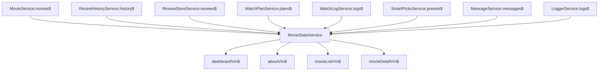
```mermaid
flowchart TB
  MovieService["MovieService.movies$"] --> MovieStateService
  RecentHistory["RecentHistoryService.history$"] --> MovieStateService
  Reviews["ReviewStoreService.reviews$"] --> MovieStateService
  WatchPlans["WatchPlanService.plans$"] --> MovieStateService
  WatchLogs["WatchLogService.logs$"] --> MovieStateService
  SmartPicks["SmartPicksService.presets$"] --> MovieStateService
  Messages["MessageService.messages$"] --> MovieStateService
  Logs["LoggerService.logs$"] --> MovieStateService

  MovieStateService --> DashboardVM["dashboardVm$"]
  MovieStateService --> AboutVM["aboutVm$"]
  MovieStateService --> MovieListVM["movieListVm$"]
  MovieStateService --> MovieDetailVM["movieDetailVm$"]
```

状态流的核心是把分散的业务服务聚合为页面 ViewModel。页面组件不直接拼装复杂统计，而是订阅 `dashboardVm$`、`movieListVm$`、`movieDetailVm$` 等 Observable，从而保持模板清晰。

### 6.5 媒体 URL 设计

电影海报、背景图和导演头像使用真实远程 URL。系统会对图片 URL 进行规范化：

- TMDB 图片统一转换为稳定尺寸路径。
- Wikimedia 图片统一走可追溯公开图片地址。
- 旧的随机占位图或不稳定图源不会作为最终展示依据。
- 图片加载失败时使用通用电影素材兜底，而不是生成伪造电影图。
- 预告片使用“片名 + 年份 + official trailer”的 YouTube 搜索链接，保证和电影标题相关。

---

## 7. 核心代码解析

### 7.1 运行时 API 配置

代表文件：

- `src/app/config/api.config.ts`
- `src/assets/runtime-config.js`

```ts
export const API_CONFIG = new InjectionToken<ApiConfig>('cinemaflow.api.config', {
  providedIn: 'root',
  factory: () => ({
    baseUrl: window.__CINEMAFLOW_CONFIG__?.apiBaseUrl || '/api'
  })
});

export function buildApiUrl(config: ApiConfig, path: string): string {
  const baseUrl = config.baseUrl.replace(/\/+$/, '');
  const normalizedPath = path.startsWith('/') ? path : `/${path}`;
  return `${baseUrl}${normalizedPath}`;
}
```

代码说明：

- `InjectionToken` 让 API 配置成为 Angular 依赖注入的一部分。
- `runtime-config.js` 在浏览器运行时提供 `apiBaseUrl`，因此前端构建产物不绑定固定后端地址。
- `buildApiUrl()` 统一处理路径拼接，避免服务层散落字符串拼接逻辑。
- `MovieService` 和 `DirectorService` 都通过该配置生成 API 地址，服务层边界更清晰。

### 7.2 MovieService 的 HTTP 同步与本地降级

代表文件：`src/app/services/movie.service.ts`

```ts
private async prefetchFromApiIfAvailable(): Promise<void> {
  if (!this.http) {
    return;
  }

  this.http.get<Movie[]>(this.apiUrl).pipe(
    map(movies => Array.isArray(movies) ? movies.map(movie => this.normalizeMovie(movie)) : []),
    tap(movies => {
      if (movies.length === 0) {
        return;
      }

      this.commitMovies(
        this.mergeApiMovies(movies),
        `Synced ${movies.length} movies from Flask API`
      );
    }),
    catchError(error => {
      this.logger.warn(`Flask movie API unavailable, using local catalog: ${this.describeHttpError(error)}`);
      return of([]);
    })
  ).subscribe();
}
```

代码说明：

- 服务初始化后会尝试从 Flask API 获取电影数据。
- API 返回的数据先进入 `normalizeMovie()`，统一日期、类型、导演 ID、媒体 URL 和预告片 URL。
- `mergeApiMovies()` 按“片名 + 年份”合并，避免重复电影。
- 后端不可用时不阻塞页面，系统继续使用本地片库，保证演示和浏览可用。
- 日志进入 `LoggerService`，关于页面可以展示运行状态。

### 7.3 RxJS 页面 ViewModel

代表文件：`src/app/services/movie-state.service.ts`

```ts
movieListVm$(queryParamMap$: Observable<ParamMap>, routeParamMap$?: Observable<ParamMap>): Observable<MovieListViewModel> {
  return combineLatest([
    this.movieService.movies$,
    queryParamMap$,
    routeParamMap$ ?? queryParamMap$
  ]).pipe(
    map(([movies, queryParamMap, routeParamMap]) => {
      const genres = collectMovieGenres(movies);
      const routeGenre = routeParamMap.get('genre')?.trim() ?? '';
      const queryState = parseMovieQueryState(queryParamMap, genres);
      const nextQueryState = routeGenre && genres.includes(routeGenre)
        ? { ...queryState, genre: routeGenre }
        : queryState;
      const filteredMovies = filterMoviesByQueryState(movies, nextQueryState);
      const pagination = paginateItems(filteredMovies, nextQueryState.page, nextQueryState.pageSize);

      return {
        movies,
        filteredMovies,
        visibleMovies: pagination.items,
        genres,
        queryState: nextQueryState,
        summaryLabel: `${filteredMovies.length} / ${movies.length} 部`,
        page: pagination.page,
        pageSize: pagination.pageSize,
        totalPages: pagination.totalPages,
        startItem: pagination.startItem,
        endItem: pagination.endItem
      };
    }),
    shareReplay({ bufferSize: 1, refCount: true })
  );
}
```

代码说明：

- `combineLatest()` 同时监听电影数据、URL 查询参数和路由参数。
- `/movies` 和 `/movies/genre/:genre` 共用同一套列表 ViewModel。
- 筛选、分页、类型解析都放在服务层，页面组件只负责展示和交互。
- `shareReplay()` 让多个订阅复用同一份计算结果，减少重复计算。

### 7.4 路由守卫

代表文件：`src/app/guards/auth.guard.ts`

```ts
export const authGuard: CanActivateFn = () => {
  const authService = inject(AuthService);
  const messageService = inject(MessageService);
  const router = inject(Router);

  if (authService.isAuthenticated) {
    return true;
  }

  messageService.warning('添加电影需要先登录。演示账号已固定为 admin / admin，可点击顶部按钮进入编辑模式。', '路由守卫');
  return router.createUrlTree(['/dashboard']);
};
```

代码说明：

- `CanActivateFn` 用于保护 `/add` 页面。
- 未登录时不显示空白页，而是通过消息服务提示用户。
- 守卫返回 `UrlTree`，由路由系统完成跳转。
- 正式后端版本应在写接口继续校验身份，前端守卫只负责用户体验和入口控制。

---

## 8. 页面截图与功能说明

> 以下截图均为有效短视口截图，不使用超长全页图。截图文件位于 `docs/screenshots/`。

### 8.1 仪表盘


仪表盘是系统入口，用于快速理解当前片库状态。页面展示总影片数、已观影数量、收藏数量、平均评分、类型分布、评分分布、导演排行、最近浏览和最近添加。用户进入系统后无需先搜索，就能知道片库整体质量、最近访问对象和下一步常用入口。

### 8.2 电影库


电影库是系统最核心的资料管理页面。它支持关键词搜索、类型筛选、排序、分页、表格/网格视图切换、已看和收藏状态识别。电影库承载“找到电影”的主流程，也为详情页、对比页、收藏中心和推荐页提供入口。

### 8.3 搜索状态


搜索状态展示了 URL 查询参数和页面状态同步的能力。用户搜索 `Inception` 后，列表只显示匹配电影。该状态可以被复制为链接，适合在汇报、分享或测试时复现同一查询结果。

### 8.4 类型路由

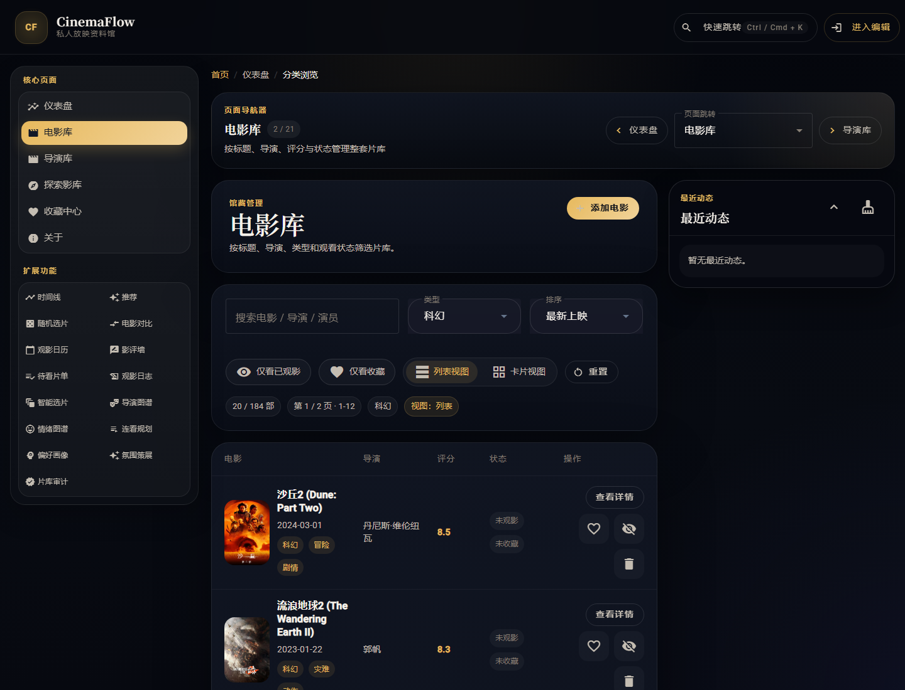

类型路由使用 `/movies/genre/:genre` 进入指定类型片库。它和普通电影库复用同一个页面组件，但通过路由参数自动注入类型过滤条件。这说明系统没有为每个类型重复创建页面，而是使用参数化路由保持结构简洁。

### 8.5 电影详情信息页


详情信息页展示单部电影的主视觉、海报、评分、类型、导演、简介、主演、个人评分、观影笔记、相邻电影和相似推荐。它是电影实体最完整的展示页面，也是收藏、已看、评分和日志等行为的上下文来源。

### 8.6 电影演员表


演员表是电影详情的子路由页面。父级详情页负责加载电影上下文，子页面只展示演员列表和角色信息。该设计让详情页可以继续扩展“剧照、幕后、奖项、影评”等更多子页面。

### 8.7 添加电影


添加电影页面用于录入新电影。表单覆盖片名、导演、上映日期、评分、类型、语言、时长、简介、演员、海报 URL、背景 URL 和预告片 URL。页面受登录守卫保护，避免普通浏览状态下误进入编辑入口。

### 8.8 导演库

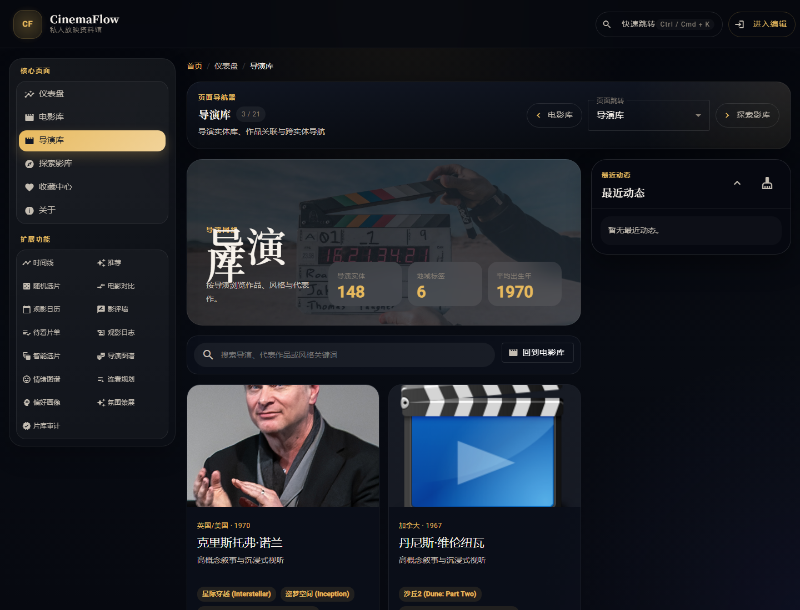

导演库按导演聚合作品，展示头像、姓名、国籍、代表作品、活跃年代和风格标签。用户可以从导演维度进入作品集合，而不是只能从电影列表逐部查找。

### 8.9 导演详情


导演详情页展示导演档案、风格描述、获奖信息、代表作品和作品列表。该页面强调“作者”和“作品”的关系，适合分析某位导演在片库中的风格和评分表现。

### 8.10 探索影库


探索影库提供更沉浸的浏览方式，适合用户没有明确搜索目标时快速扫片。页面通过大图、评分和基础信息帮助用户快速判断是否进入详情。

### 8.11 收藏中心

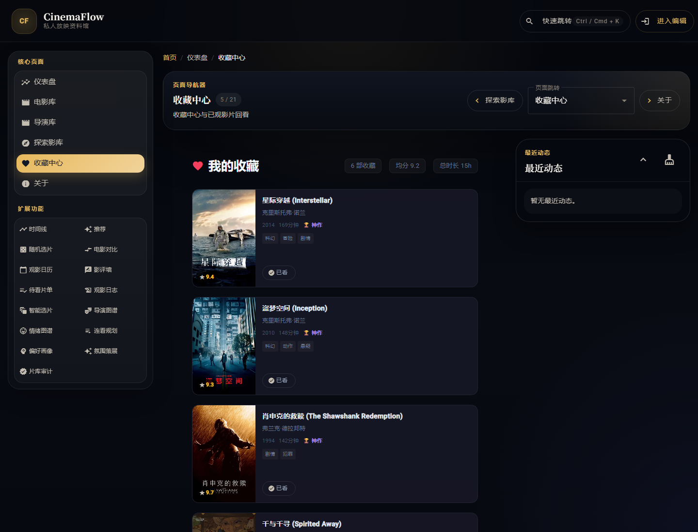

收藏中心汇总用户标记为收藏的电影。它相当于用户个人片库中的高价值子集，适合快速回看、推荐和偏好分析。收藏数据会被偏好画像和智能选片作为重要信号。

### 8.12 时间线

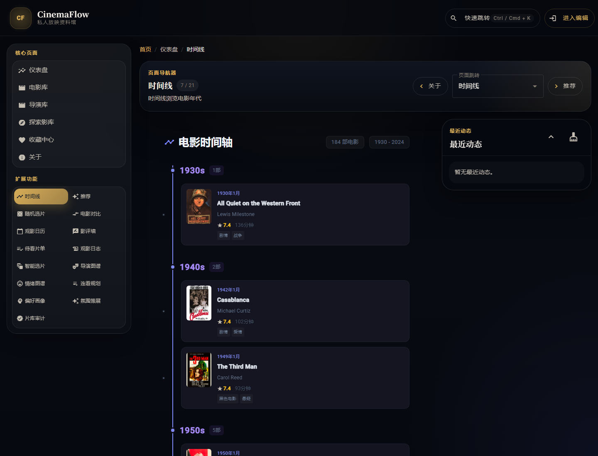

时间线按上映年代组织电影，帮助用户观察片库覆盖的时间跨度。它能展示用户偏好的年代分布，也能发现某些年代的资料空白。

### 8.13 推荐页

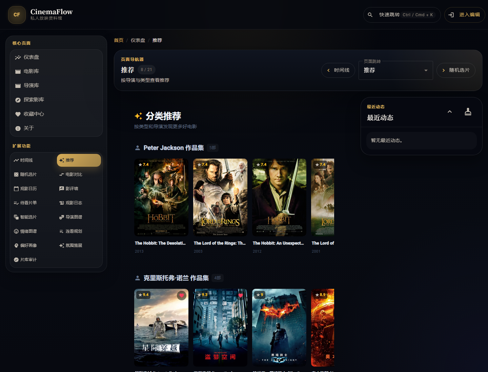

推荐页基于电影类型、导演和评分相近度生成推荐。它面向“看完一部后还想看类似电影”的场景，是从详情页延伸出的发现路径。

### 8.14 随机选片

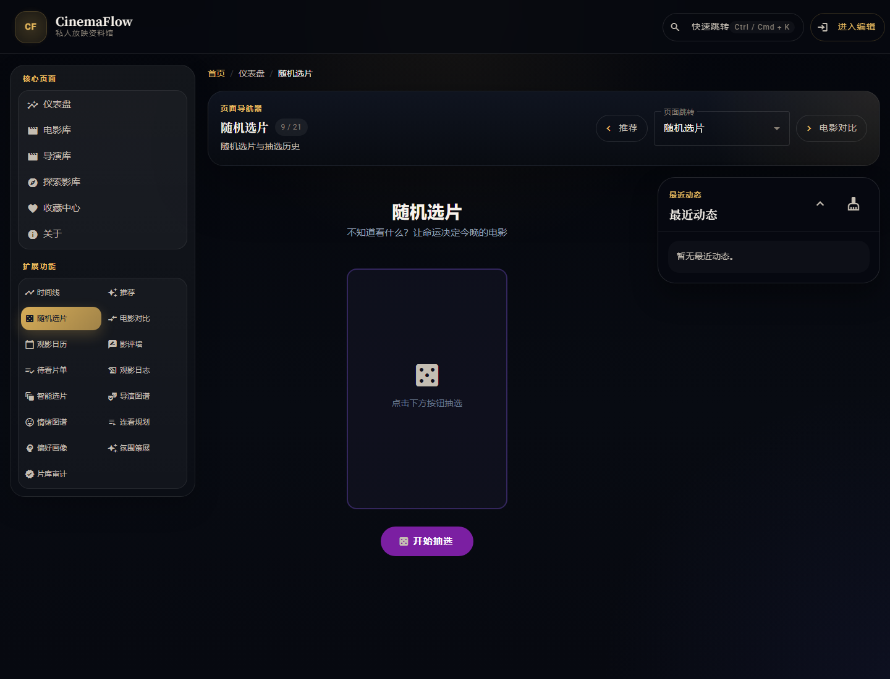

随机选片用于解决临时决策问题。用户不想设置复杂条件时，可以直接让系统抽取候选电影。该功能适合轻量场景，也能和智能选片形成互补。

### 8.15 电影对比

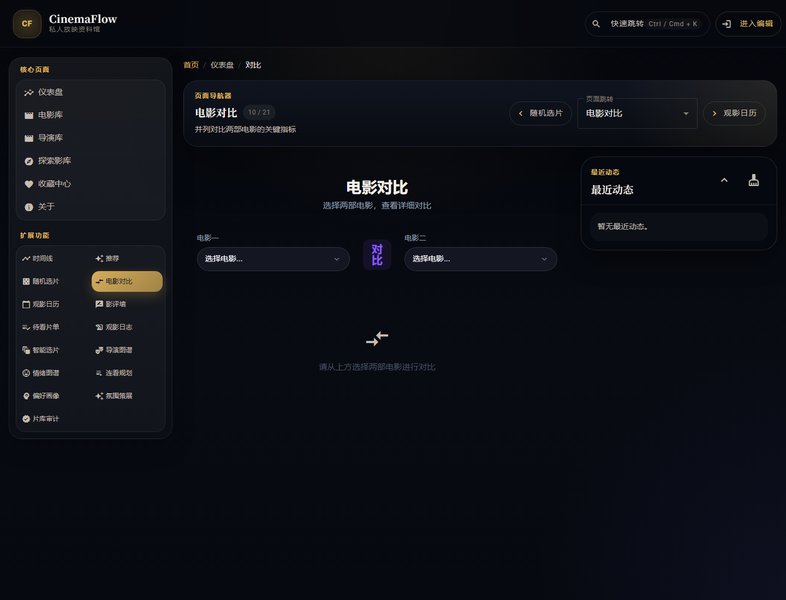

电影对比页面允许选择两部电影并列查看，从评分、时长、类型、导演、语言等维度比较。它适合用户在两部候选电影之间犹豫时做决策。

### 8.16 观影日历

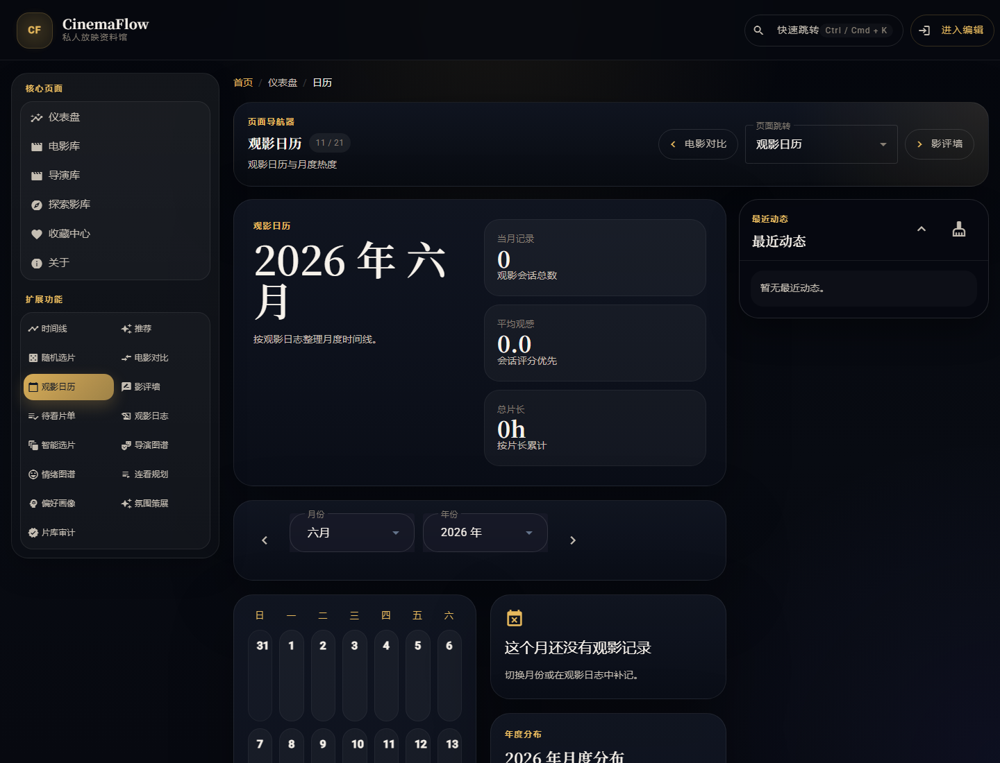

观影日历基于观影日志，而不是电影上映日期。它展示用户真实观看行为在时间上的分布，可以看到哪天观看了什么、年度观看热度如何。

### 8.17 影评墙

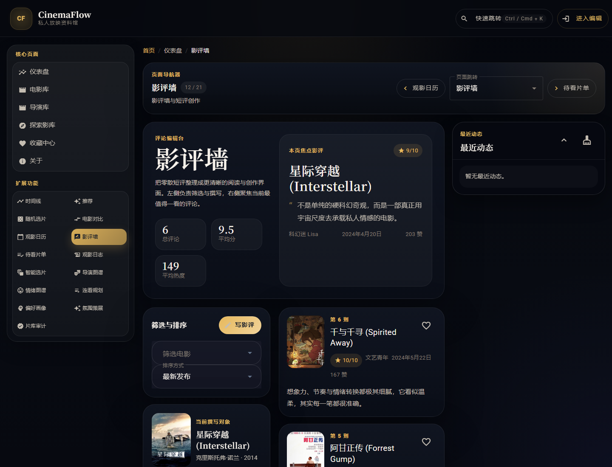

影评墙用于沉淀文字评价。用户可以为电影写下作者、评分和评论内容，也可以浏览已有评论和点赞。影评是偏好画像和电影评价的重要补充。

### 8.18 待看片单


待看片单管理“未来想看”的电影。每条计划包含优先级、计划日期、观看场景、状态和备注。它把电影从普通收藏进一步推进到具体观看安排。

### 8.19 观影日志


观影日志记录实际观看事件，包括观看时间、地点、陪伴对象、会话评分、情绪标签和笔记。日志是观影日历、情绪图谱和偏好画像的基础数据。

### 8.20 智能选片


智能选片按时长、最低评分、类型、语言、是否包含已看、是否偏好收藏等条件生成候选电影。用户可以保存常用预设，例如“下班后轻松看”“周末长片”“只看高分科幻”。

### 8.21 导演图谱

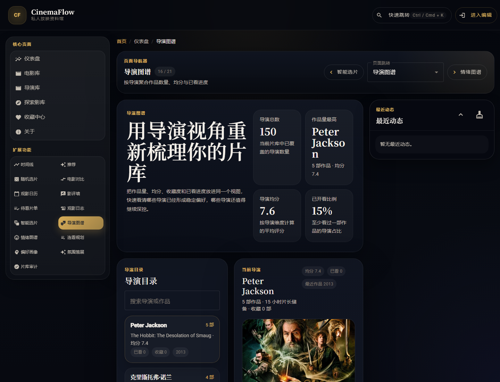

导演图谱按导演聚合作品数量、平均评分、收藏数、已看数和总时长。它把电影列表转换为导演维度的统计视图，适合观察片库中哪些导演占比更高。

### 8.22 情绪图谱


情绪图谱读取观影日志里的情绪标签，统计治愈、热血、沉重、浪漫等标签分布。它帮助用户从“看了什么”进一步分析“为什么喜欢”和“观看时的情绪需求”。

### 8.23 连看规划


连看规划根据用户设置的总时长预算和类型偏好组合连续观影片单。它适合周末、假期或主题观影夜，解决“多部电影如何组合”的问题。

### 8.24 偏好画像


偏好画像综合已看、收藏、个人评分、影评和观影日志，展示类型、导演、语言、年代等偏好。它是系统从资料管理走向个人分析的核心页面。

### 8.25 氛围策展


氛围策展按视觉气质、主题和情绪重新组织电影。它不只按类型分类，而是从“适合什么心情、什么夜晚、什么场景”出发形成主题片单。

### 8.26 片库审计


片库审计用于检查电影资料完整度，包含海报 URL、背景 URL、简介、演员表、语言、片长等字段。它帮助资料维护者发现缺失项和低质量媒体资源。

### 8.27 关于页面


关于页展示系统技术栈、模块总览、服务状态、最近消息和运行日志。它既是系统说明页，也是观察服务状态和数据管理入口的集中页面。

### 8.28 命令面板


命令面板提供全局快速跳转和搜索。用户可以搜索页面、电影或导演，并直接进入目标位置。它减少了多页面系统中的导航成本。

### 8.29 最近浏览区域


最近浏览区域展示用户近期打开过的电影详情。它帮助用户回到刚才看过的电影，尤其适合在对比、推荐和搜索之间频繁跳转时恢复上下文。

### 8.30 数据管理区域


数据管理区域支持导入导出片库、影评、最近浏览、待看片单、观影日志和智能预设。它为个人资料迁移和备份提供入口，也让系统具备离线演示和恢复能力。

---

## 9. 系统问题与总结

### 9.1 关键设计取舍

| 设计点 | 取舍说明 |
| --- | --- |
| 前端本地状态与后端 API 并存 | 保证浏览体验稳定，同时保留向数据库持久化演进的接口边界 |
| 图片 URL 真实化 | 避免随机占位图造成资料不可信，优先使用可追溯远程资源 |
| 电影状态拆为用户状态表 | 多用户场景下，同一部电影的收藏、已看和评分应因人而异 |
| 页面 ViewModel 服务化 | 避免页面模板直接拼装复杂统计，让组件更专注展示 |
| 详情页使用子路由 | 让基本信息、演员表等内容可以独立扩展 |
| 片库审计独立成页 | 把资料质量变成可见功能，而不是隐藏在代码逻辑中 |

### 9.2 当前系统适合的场景

- 个人电影资料管理。
- 电影课程项目展示。
- 前后端分离架构演示。
- Angular 状态流和组件化设计展示。
- 关系型数据库建模说明。
- 影迷偏好分析和观影记录沉淀。

### 9.3 后续可扩展方向

- 后端接入 SQLAlchemy，将 JSON 持久层替换为关系型数据库。
- 增加登录接口、JWT 或 Session，并在写接口做权限校验。
- 增加 OpenAPI 文档，提升接口可读性。
- 增加数据库迁移工具，例如 Alembic。
- 将影评、日志、计划、智能预设全部迁移到后端持久化。
- 增加端到端测试覆盖搜索、添加电影、收藏、日志、导入导出等路径。
- 为媒体 URL 增加定时健康检查和自动修复建议。

### 9.4 总结

CinemaFlow 的核心价值在于把电影资料、用户观影行为和偏好分析连接起来。它不是单纯的电影列表，而是一个完整的私人电影资料馆系统。系统通过前后端分离架构保持页面交互和后端数据边界清晰，通过关系型数据库设计表达电影、导演、演员、用户行为和审计之间的关系，通过多页面功能覆盖浏览、记录、推荐、分析和维护的完整链路。
