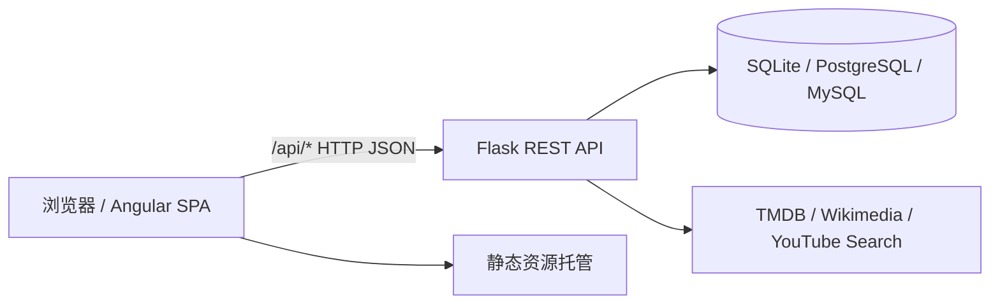

# CinemaFlow 前后端分离架构说明

## 改造目标

CinemaFlow 原型阶段已经采用 Angular + Flask 两个目录组织，但前端服务仍以本地 Mock、浏览器 `localStorage` 和固定 `/api` 字符串为主。改造后的目标是让前端、后端、数据库三层边界清晰：

- 前端只负责路由、组件、状态流、用户交互和静态资源。
- 后端只负责 REST API、数据校验、持久化、跨域策略和未来权限校验。
- 数据库负责保存电影、导演、影评、待看片单、观影日志、情绪标签、最近浏览和智能预设。

## 新架构分层



## 前端边界

- `src/app/app.routes.ts` 定义所有页面路由和懒加载组件。
- `src/app/config/api.config.ts` 提供 `API_CONFIG` 注入令牌，避免服务层硬编码 API 根路径。
- `src/assets/runtime-config.js` 在浏览器运行时指定 API 地址，生产部署只需替换该文件，不必重新编译 Angular。
- `MovieService`、`DirectorService` 只通过 `HttpClient` 访问 `/api/movies` 和 `/api/directors`。
- 业务状态仍保留本地兜底，后端不可用时不影响演示，但所有写操作会尝试同步到 Flask API。
- 媒体 URL 由 `src/app/utils/movie-media.ts` 统一校验、优化和兜底。

## 后端边界

- `cinemaflow-api/app.py` 只负责应用装配、CORS 和健康检查。
- `cinemaflow-api/routes/movies.py` 暴露电影查询、新增、更新、删除接口。
- `cinemaflow-api/routes/directors.py` 暴露导演查询、新增、删除和导演作品接口。
- `cinemaflow-api/models.py` 当前使用 JSON 文件作为轻量持久层，并通过 `CINEMAFLOW_DATA_FILE` 支持部署环境改路径。
- `cinemaflow-api/Dockerfile` 使用 Waitress 作为 WSGI 入口，避免生产环境直接使用 Flask debug server。

## 数据库落地路径

当前仓库为了保持课程演示轻量，默认仍使用 `cinemaflow-data.json`。数据库设计已经落在 `docs/database/schema.sql`，迁移顺序建议如下：

1. 创建 `directors`、`movies`、`movie_genres`、`movie_cast` 主档表。
2. 从 JSON 文件导入电影和导演数据。
3. 增加 `reviews`、`watch_plans`、`watch_logs`、`watch_log_moods` 等用户行为表。
4. 后端新增 repository 层，把 routes 从 JSON 列表操作切换到 SQL 查询。
5. 前端 API 合约不变，因此 UI 不需要跟随数据库迁移改版。

## 部署拓扑

开发环境：

```text
Angular Dev Server :4200 --proxy /api --> Flask API :5000 --> JSON / DB
```

生产环境：

```text
静态托管 Angular dist  --> HTTPS API 域名 --> Flask 容器 --> 数据库
```

## 本次真实 URL 修复

- 电影海报/背景继续优先使用 TMDB 和 Wikimedia 等真实电影资源。
- 移除 `picsum.photos` 随机占位生成，无法识别真实媒体时使用可追溯的 Wikimedia 通用电影素材。
- 导演头像改为真实 Wikimedia 人物图，未知导演使用通用电影摄影机图，避免伪造人物肖像。
- 种子电影的预告片从 W3Schools 演示视频改为按“片名 + 年份 + official trailer”生成的 YouTube 搜索链接。
